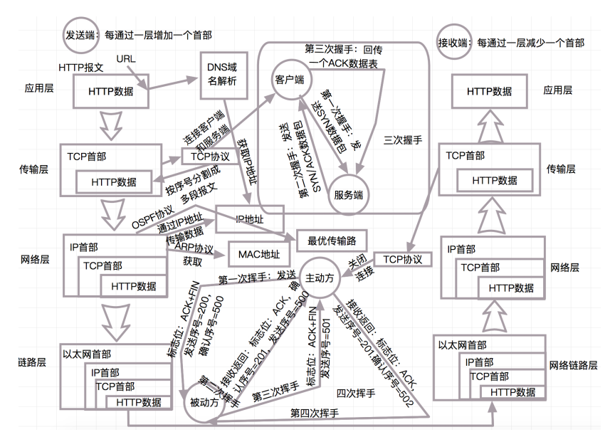

# 基础

## 面向对象和面向过程的区别

面向过程：用函数一步一步的实现需求，需要的时候进行调用

面向对象：把问题分为多个对象，建立对象也是为了描述事物解决问题的过程发生的行为；面向对象有**封装、集成、多态**的特性；易维护、复用、扩展


## 线程、程序、进程的基本概念。以及他们之间关系

简单的来说，程序是静态的代码集合，进程是程序的执行实例，而线程是进程内部的执行单元

关系是程序被加载到内存中执行后，会创建一个进程，进程内部可以包含一个或多个线程，线程共享进程的资源


## 重写和重载区别

重写：

1. 子类集成父类或实现接口（对方法的重写）
2. 方法名、参数列表、返回类型 必须相同
3. 子类方法修饰符 > 被重写的方法修饰符
4. 不能抛出新的异常

重载

同类中，同名的方法不同参数；类型不同，个数不同；对返回类型无要求


## == 和 equal

== 变量在“栈”里面，对象在“堆”里面；两端比较的是内存中的地址

equals 比较的是两个对象的内容是否相等；一般将常量写在左侧


## Java创建对象有几种方式

1. new创建新对象
2. 通过反射机制
3. 采用clone机制
4. 通过序列化机制


## String、StringBuffer 和 StringBuilder区别

String 是只读字符串，是一个对象，被final修饰的字符数组，被引用的字符串不能被改变，因此每次对String的操作都会生成新的String对象

StringBuffer 和 StringBuilder都继承于了AbstractStringBuilder抽象类

底层都是可变的字符数组，对字符串频繁操作建议用StringBuffer 和 StringBuilder

StringBuffer 加了同步锁，因此线程安全；而StringBuilder则没有对此操作，因此线程不安全，但效率相当于StringBuffer 高


## 有数组了为什么还要搞个 ArrayList

在使用的时候，如果在不明确要插入多少数据的情况下，普通数组就很尴尬了

而 ArrayList 可以使用默认的大小，当元素个数到达一定程度 后，会自动扩容


## ArrayList和linkedList的区别

ArrayList 基于数组实现，数组则是基于索引数据结构，因此搜索和读取比较快；删除开销大，因为需要对数组中所有数据进行重排

linkedList 是一个双向链表，在添加和删除更优，查询弱于ArrayList （基本是指数据量大时）


父类不同

1. arraylist <--- abstractLIst < --- collection
2. linkedList <--- abstractSquentialList < ---abstractList <--- collection


## List,Set,Map三者的区别

- List：
  - 是一个有序集合，可以包含重复元素
  - 按照插入顺序访问元素，并且可以通过索引进行随机访问
  - 通过索引查找快，增删速度慢
- Set：
  - 不允许包含重复元素的集合
  - 保证元素的顺序
  - 检索元素效率低下，删除和插入效率高
- Map：
  - 是一个键值对的集合，每个键都唯一
  - 键是不可重复的，但值可以重复
  - 不保证键值对的顺序


## HashMap和HashTable的区别

1. 父类不同
   1. HashMap是继承自AbstractMap类
   2. 而Hashtable是继承自Dictionary类。
2. 对null的支持不同
   1. Hashtable：key和value都不能为null
   2. HashMap：key可以为null，但是这样的key只能有一个，因为必须保证key的唯一性；可以有多个 key值对应的value为null。
3. 安全性不同
   1. HashMap是线程不安全的，在多线程并发的环境下，可能会产生死锁等问题
   2. Hashtable是线程安全的，它的每个方法上都有synchronized 关键字
   3. ConcurrentHashMap虽然也是线程安全的，但是它的效率比Hashtable要高好多倍。因为 ConcurrentHashMap使用了分段锁，并不对整个数据进行锁定。
4. 初始容量大小和每次扩充容量大小不同
   1. HashMap初始容量为16，当容量为16*0.75时，每次扩容是原容量的两倍
   2. HashTable初始容量为11，当容量为11*0.75时，每次扩容是原容量的两倍+1
5. 计算hash值的方法不同
   1. HashMap和HashTable都是通过调用键对象的`hashCode()`方法来计算哈希码，但是HashTable还会进行额外的处理以确保哈希码为正数


## HashMap 的长度为什么是 2 的 N 次方呢

为了能让 HashMap 存数据和取数据的效率高，尽可能地减少 hash 值的碰撞

也就是说尽量把数 据能均匀的分配，每个链表或者红黑树长度尽量相等

```
取余（%）操作中如果除数是 2 的幂次，则等价于与其除数减一的与（&）操作（也就是说
hash % length == hash &(length - 1) 的前提是 length 是 2 的 n 次方）。并且，采用二进
制位操作 & ，相对于 % 能够提高运算效率
```


## HashMap 与 ConcurrentHashMap 的异同

1. 都是 key-value 形式的存储
2.  HashMap 是线程不安全的，ConcurrentHashMap 是 JUC 下的线程安全的
3.  HashMap 底层数据结构是数组 + 链表（JDK 1.8 之前）。JDK 1.8 之后是数组 + 链表 + 红黑 树。当链表中元素个数达到 8 的时候，链表的查询速度不如红黑树快，链表会转为红黑树，红 黑树查询速度快
4. HashMap 初始数组大小为 16（默认），当出现扩容的时候，以 0.75 * 数组大小的方式进行扩 容；
5. ConcurrentHashMap 在 JDK 1.8 之前是采用分段锁来现实的 Segment + HashEntry
   1. Segment 数组大小默认是 16，2 的 n 次方；JDK 1.8 之后，采用 Node + CAS + Synchronized 来保证并发安全进行实现


## SynchronizedMap和ConcurrentHashMap有什么区别

**SynchronizedMap**：通过Collections工具类提供的静态方法`Collections.synchronizedMap()`来创建的，通过在每个方法上添加`synchronized`关键字来实现同步

**ConcurrentHashMap**： 使用分段锁（Segment），将整个Map分成多个Segment，每个Segment拥有自己的锁，不同Segment的数据可以并发读写


## 红黑树有哪几个特征

- 每个节点是 黑色或红色
- 根节点是黑色
- 每个叶子节点都是黑色(指向空的叶子节点)
- 如果一个叶子节点是红色，那么其子节点必须都是黑色的
- 从一个节点到该节点的子孙节点的所有路径上包含相同数目的黑节点


##  Java的四种引用，强弱软虚

强引用

平常中使用最多的引用，强引用在程序内存不足（OOM）的时候也不会被回收

```java
String str = new String("str");
System.out.println(str);
```


弱引用

弱引用就是只要JVM垃圾回收器发现了它，就会将之回收

```
WeakReference<String> wrf = new WeakReference<String>(str);
```


软引用

软引用在程序内存不足时，会被回收

```java
SoftReference<String> wrf = new SoftReference<String>(new String("str"));
```


虚引用

虚引用的回收机制跟弱引用差不多，但是它被回收之前，会被放入 ReferenceQueue 中

```java
PhantomReference<String> prf = new PhantomReference<String>(new String("str"),
new ReferenceQueue<>());
```


## 深拷贝和浅拷贝的区别

浅拷贝 仅复制对象本身，而不复制对象内部的引用类型成员

深拷贝 不仅复制对象本身，还会递归地复制对象内部的引用类型成员


## final，finally和finalize区别

- **final**
  - `final`用于修饰类时，表示该类不能被继承
  - `final`用于修饰方法时，表示该方法不能被子类重写
  - `final`用于修饰变量时，表示该变量的值只能被赋值一次，即为常量
- **finaly**
  - `finally`是一个关键字，用于定义在try-catch语句中的代码块。无论异常是否被捕获，`finally`块中的代码都会被执行
- **finalize**
  - `inalize`是Object类中的一个方法，用于在对象被垃圾回收前执行清理操作


## Java 序列化中如果有些字段不想进行序列化

对于不想进行序列化的变量，使用 transient 关键字修饰。


##  IO 流

- 按照流的流向分，可以分为输入流和输出流； 
- 按照操作单元划分，可以划分为字节流和字符流；


- InputStream/Reader: 所有的输入流的基类，前者是字节输入流，后者是字符输入流。
- OutputStream/Writer: 所有输出流的基类，前者是字节输出流，后者是字符输出流。


## IO与 NIO的区别

是Java中用于处理输入和输出的API

IO：IO是基于流（Stream）的模型，它使用阻塞式I/O（Blocking I/O）来处理输入和输出

NIO：NIO是基于通道（Channel）和缓冲区（Buffer）的模型，它使用非阻塞式I/O来处理输入和输出


NIO相比于传统IO具有更好的性能和可扩展性，特别是在处理大量并发连接时。

传统IO适合于较少的连接数和简单的应用程序，而NIO适用于需要处理大量并发连接和高性能的网络应用程序


## 实现多线程有几种方法

1. 继承Thread类
2. 实现Runnable接口
3. 实现Callable接口（ JDK1.5>= ）
4. 线程池方式创建


### 实现Runnable、Callable接口的方式创建线程的优缺点

**Runnable**

- 优点：线程类只是实现了Runnable或者Callable接口，还可以继承其他类
- 缺点：编程稍微复杂一些，如果需要访问当前线程，则必须使用 Thread.currentThread() 方法

****

**Callable**

- 优点：：编写简单，如果需要访问当前线程，则无需使用 Thread.currentThread() 方法，直接使用 this即可获取当前线程

- 缺点：：因为线程类已经继承了Thread类，Java语言是单继承的，所以就不能再继承其他父类了


## 如何停止一个正在运行的线程

1. 使用退出标志
2. 使用stop方法强行终止
3. 使用interrupt方法中断线程


## notify()和notifyAll()区别

**notify**：用于唤醒在当前对象上等待的单个线程；可能会导致死锁；

​	如果有多个线程在当前对象上调用了`wait()`方法进入等待状态，那么只有一个线程会被唤醒，但是哪一个线程被唤醒是不确定的。

**notifyAll**：用于唤醒在当前对象上等待的所有线程；不会导致死锁


## sleep()和wait()区别

**sleep**：属于Thread类；不会释放锁；时间到会⾃动恢复

**wait**：属于Object类；会释放当前线程持有的对象锁；需使⽤ notify()/notifyAll()直接唤醒


## Thread 类中的start() 和 run() 方法区别

start()方法被用来启动新创建的线程，执行内部调用了run()方法；


## 有三个线程T1,T2,T3,如何保证顺序执行

可以用线程类的join()方法在一个线程中启动另一 个线程另外一个线程完成该线程继续执行。

为了确保三个线程的顺序你应该先启动最后一个(T3调 用T2，T2调用T1)，这样T1就会先完成而T3最后完成

```java
Thread T1 = new Thread(() -> {
    // T1的任务
});

Thread T2 = new Thread(() -> {
    try {
        T1.join(); // 等待T1执行完成
    } catch (InterruptedException e) {
        e.printStackTrace();
    }
    // T2的任务
});

Thread T3 = new Thread(() -> {
    try {
        T2.join(); // 等待T2执行完成
    } catch (InterruptedException e) {
        e.printStackTrace();
    }
    // T3的任务
});

T1.start();
T2.start();
T3.start();

```


## Thread类中的yield方法有什么作用

法可以暂停当前正在执行的线程对象，让其它有相同优先级的线程执行


## 线程池中submit() 和 execute()方法有什么区别

**execute**： 定义在Executor接口中，execute()方法的返回类型是void

**submit**： 定义在ExecutorService接口中，返回持有计算结果的Future对象


## 对线程池的理解

1. 降低资源消耗
2. 提高响应速度
3. 提高线程的可管理性；如果无限制的创建，不仅会消耗系统资源，还会降 低系统的稳定性


## 常用的线程池

- newSingleThreadExecutor：创建一个单线程的线程池，此线程池保证所有任务的执行顺序按 照任务的提交顺序执行。 
- newFixedThreadPool：创建固定大小的线程池，每次提交一个任务就创建一个线程，直到线 程达到线程池的最大大小。
-  newCachedThreadPool：创建一个可缓存的线程池，此线程池不会对线程池大小做限制，线 程池大小完全依赖于操作系统（或者说JVM）能够创建的最大线程大小。 
- newScheduledThreadPool：创建一个大小无限的线程池，此线程池支持定时以及周期性执行 任务的需求。 
- newSingleThreadExecutor：创建一个单线程的线程池。此线程池支持定时以及周期性执行任 务的需求


## 产生死锁的四个必要条件

1. 互斥条件：一个资源每次只能被一个线程使用 
2. 请求与保持条件：一个线程因请求资源而阻塞时，对已获得的资源保持不放 
3. 不剥夺条件：进程已经获得的资源，在未使用完之前，不能强行剥夺
4. 循环等待条件：若干线程之间形成一种头尾相接的循环等待资源关系


## 如何避免死锁

指定获取锁的顺序

比如只有获得A锁的线程才有资格获取B锁，按顺序获取锁就可 以避免死锁！


## 线程安全需要保证几个基本特征

- 原子性，简单说就是相关操作不会中途被其他线程干扰，一般通过同步机制实现。 
- 可见性，是一个线程修改了某个共享变量，其状态能够立即被其他线程知晓，通常被解释为将 线程本地状态反映到主内存上，volatile 就是负责保证可见性的。
- 有序性，是保证线程内串行语义，避免指令重排等


## ThreadLocal原理

**内部实现**

- 对象内部都包含了一个ThreadLocalMap对象
- ThreadLocalMap是一个自定义的散列表，它的键是ThreadLocal对象，值是对应线程的变量副本
- ThreadLocal的`get()`；获取当前线程，并通过当前线程获取对应的ThreadLocalMap对象，然后从Map中根据ThreadLocal对象获取变量副本
- ThreadLocal的`set()`方法；先获取当前线程，并通过当前线程获取对应的ThreadLocalMap对象，然后将ThreadLocal对象和变量副本存入Map中
- ThreadLocal的`remove()`方法；获取当前线程，并通过当前线程获取对应的ThreadLocalMap对象，然后从Map中移除对应的键值对。


**线程间隔离**

- 每个线程都拥有自己的ThreadLocalMap对象，不同线程之间的变量副本相互独立，互不影响
- 创建ThreadLocal对象并设置变量值时，只有当前线程可以访问该变量，其他线程无法访问
- 即使是相同的ThreadLocal对象，不同线程之间的变量副本也是独立的


# spring

## 什么是spring

Spring 是一个轻量级的IoC和AOP容器框架。用于简化企业应用程序的开发

有以下优点：

- 轻量：Spring 是轻量的，基本的版本大约2MB。
- 控制反转：Spring通过控制反转实现了松散耦合，对象们给出它们的依赖，而不是创建或查找 依赖的对象们
-  面向切面的编程(AOP)：Spring支持面向切面的编程，并且把应用业务逻辑和系统服务分开。
- 容器：Spring 包含并管理应用中对象的生命周期和配置。
- MVC框架：Spring的WEB框架是个精心设计的框架，是Web框架的一个很好的替代品。
- 事务管理：Spring 提供一个持续的事务管理接口，可以扩展到上至本地事务下至全局事务
- 异常处理：Spring 提供方便的API把具体技术相关的异常（比如由JDBC，Hibernate or JDO抛 出的）转化为一致的unchecked 异常


有以下核心模块：

- Spring Core：核心类库，提供IOC服务；
- Spring Context：提供框架式的Bean访问方式，以及企业级功能（JNDI、定时任务等）；
- Spring AOP：AOP服务； Spring DAO：对JDBC的抽象，简化了数据访问异常的处理
- Spring ORM：对现有的ORM框架的支持
- Spring Web：提供了基本的面向Web的综合特性，例如多方文件上传；
- Spring MVC：提供面向Web应用的Model-View-Controller实现。


##  Autowired和Resource关键字的区别

@Resource和@Autowired都是做bean的注入时使用

@Resource并不是Spring的注解，是java的原生注解；按照ByName自动注入

@Autowired为Spring提供的注解；按照类型（byType）装配依赖对象


## 依赖注入的几种方式

1. 构造器注入
2. setter注入
3. 接口注入


## 对Spring MVC的理解

是spring在原 有基础上，又提供了web应用的MVC模块

可以简单的把springMVC理解为是spring的一个模块


MVC模式

MVC：MVC是一种设计模式

- M-Model 模型（完成业务逻辑：有javaBean构成，service+dao+entity）
- V-View 视图（做界面的展示 jsp，html……）
- C-Controller 控制器（接收请求—>调用模型—>根据结果派发页面）


```
1、 用户发送请求至前端控制器DispatcherServlet。
2、 DispatcherServlet收到请求调用HandlerMapping处理器映射器。
3、 处理器映射器找到具体的处理器(可以根据xml配置、注解进行查找)，生成处理器对象及处理器
拦截器(如果有则生成)一并返回给DispatcherServlet。
4、 DispatcherServlet调用HandlerAdapter处理器适配器。
5、 HandlerAdapter经过适配调用具体的处理器(Controller，也叫后端控制器)。
6、 Controller执行完成返回ModelAndView。
7、 HandlerAdapter将controller执行结果ModelAndView返回给DispatcherServlet。
8、 DispatcherServlet将ModelAndView传给ViewReslover视图解析器。
9、 ViewReslover解析后返回具体View。
10、DispatcherServlet根据View进行渲染视图（即将模型数据填充至视图中）。
11、 DispatcherServlet响应用户。
```


## SpringMVC常用的注解

- @RequestMapping
- @RequestBody
- @ResponseBody


## 对Spring的AOP理解

AOP（Aspect-Oriented Programming，面向切面编程）能够将那些与业务无关，却为业务模块所 共同调用的逻辑或责任（例如事务处理、日志管理、权限控制等）封装起来，便于减少系统的重复 代码，降低模块间的耦合度，并有利于未来的可扩展性和可维护性。


Spring AOP是基于动态代理的，如果要代理的对象实现了某个接口，那么Spring AOP就会使用JDK 动态代理去创建代理对象

而对于没有实现接口的对象，就无法使用JDK动态代理，转而使用CGlib 动态代理生成一个被代理对象的子类来作为代理


## 对Spring的IOC理解

IOC就是控制反转，是指创建对象的控制权的转移。

最直观的表达就是，IOC让对象的创建不用去new了，可以由spring自动生产，使用java的反 射机制

Spring的IOC有三种注入方式 ：构造器注入、setter方法注入、根据注解注入。


## spring bean的生命周期

实例化

初始init

接收请求service

销毁destroy


## Spring支持的几种bean的作用域

- singleton：默认单例
- prototype：为每一个bean请求提供一个实例
- request：为每一个网络请求创建一个实例；在请求完成以后，bean会失效并被垃圾回收器回收
- session：与request范围类似，确保每个session中有一个bean的实例，在session过期后， bean会随之失效。
- global-session：全局作用域


## Spring框架中都用到了哪些设计模式

- 简单工厂模式
  - Spring 中的 BeanFactory 就是简单工厂模式的体现
- 工厂模式
  - Spring 中的 FactoryBean 就是典型的工厂方法模式
- 单例模式
  - 在 spring 中（作用域）用到的单例模式有： scope="singleton" ，注册式单例模式，bean 存放于 Map 中。bean name 当做 key，bean 当做 value。
- 原型模式
  - 在 spring 中用到的原型模式有： scope="prototype" ，每次获取的是通过克隆生成的新实例
- 代理模式
  - Spring 中经典的 AOP，就是使用动态代理实现的，分 JDK 和 CGlib 动态代理
- 适配器模式
  - Spring 中的 AOP 中 AdvisorAdapter 类
- 观察者模式
  - Spring 中的 Event 和 Listener
    - ApplicationEvent，该抽象类继承了 EventObject 类，JDK 建议所有的事件都应该继承自 EventObject。
    - ApplicationListener，该接口继承了 EventListener 接口，JDK 建议所有的事件监听器都应该继承 EventListener
- 模板模式
  - JdbcTemplate 就是非常经典的模板模式 的应用，里面的 execute 方法，把整个算法步骤都定义好了
- 责任链模式
  - DispatcherServlet 中的 doDispatch() 方法中获取与请求匹配的处理器 HandlerExecutionChain，this.getHandler() 方法的处理使用到了责任链模式


## Spring 中 ApplicationContext 和 BeanFactory 的区别

- 所属包不同
  - BeanFactory在spring-beans.jar
  - ApplicationContext在spring-context.jar
- 国际化
  - BeanFactory 不支持国际化，没有实现MessageResource
  - ApplicationContext 却可以
- 事件机制
  - ApplicationContext事件机制是观察者设计模式的 实现，通过ApplicationEvent类和ApplicationListener接口，可以实现ApplicationContext事件处理。 如果容器中有一个ApplicationListener Bean，每当ApplicationContext发布ApplicationEvent时，ApplicationListener Bean将自动被触发
- 底层资源的访问
  - ApplicationContext 扩展了 ResourceLoader（资源加载器）接口，从而可以用来加载多个 Resource
  - BeanFactory 是没有扩展 ResourceLoader
- 创建方式
  - BeanFactory 通常以编程的方式被创建
  - ApplicationContext 能以声明的方式创建，也可以使用编程的方式
    - 编程式：通过代码new的方式
    - 声明式：通过配置文件或注解的方式
- 延迟加载
  - BeanFactroy 采用的是延迟加载形式来注入 Bean ；只有在使用时才会具体实例化bean
  - ApplicationContext 是容器启动时就创建所有bean


## Spring 框架中的单例 Bean 是线程安全的么

spring 中的 bean 默认是[单例](https://so.csdn.net/so/search?q=单例模式&spm=1001.2101.3001.7020)的；框架并没有对单例 bean 进行多线程的封装处理

某种程度上来说 bean 也是安全的；但如果 Bean 内部存在可变状态，开发者需要自行确保线程安全性


## Spring 是怎么解决循环依赖的

A依赖B；B依赖A

自我依赖

A依赖B；B依赖C；C依赖A；

使用三级缓存，就用用来存放不同类型的bean

一级缓存，存放的是完全初始化好的bean，可以直接使用

二级缓存，存放的原始bean，其里面的属性还没被赋值

三级缓存，存放的是bean工厂对象，生成原始bean对象，并放入二级缓存


主要是把bean的实例化，bean的属性注入分离出来


- 多实例的Setter注入导致的循环依赖，需要把Bean改成单例。
- 构造器注入导致的循环依赖，可以通过@Lazy注解
- DependsOn注解： 使用@DependsOn注解指定依赖项的加载顺序，以避免出现循环依赖问题
- 重新设计


## 解决依赖冲突的方法

- 情况一：项目依赖了同一Jar包的多个版本，并且选错了版本；
- 情况二：同样的类在不同的Jar包中出现，导致JVM加载了错误的类；


- Maven：在命令行中执行mvn dependency:tree，查看项目的依赖树，找出冲突的依赖；在pom.xml中使用标签来排除冲突的依赖版本。
- 设置 classpath 指定jar包加载的先后顺序


## 事务三要素

- 数据源：表示具体的事务性资源，是事务的真正处理者，如MySQL等。
- 事务管理器：像一个大管家，从整体上管理事务的处理过程，如打开、提交、回滚等。
- 事务应用和属性配置：像一个标识符，表明哪些方法要参与事务，如何参与事务，以及一些相关属 性如隔离级别、超时时间等。


## 事务的隔离级别

- 未提交读(Read Uncommitted)：可读取到事务未提交的数据，隔离性差，会出现脏读，不可重复读，幻读问题
  - 脏读：在一个事务中，修改数据还没提交，就被另一个事务读取到了；产生错误是数据
  - 不可重复读：在一个事务中，两次读取同一数据却得到了不同的结果；可能是因为在两次读取之间另一个事务修改了数据并且提交了
  - 幻读：在一个事务中，两次查询同一个范围的数据，但是得到了不同数量的行。这是因为在两次查询过程中有另外一个事务插入数据造成的。
    - 不可重复读是在同一个数据行上发生的，而幻读是在一个数据范围上发生的
    - 不可重复读是由于并发事务中的数据更新导致的，而幻读则是由于并发事务中的数据插入导致的
- 已提交读(Read Committed)：可读取到事务已提交的数据，隔离性一般，不会出现脏读问题，但是会出现不可重复读，幻读问题
- 可重复读(Repeated Read)：可防止脏读（当前内存读），防止不可重复读问题，防止会出现的幻读问题，但是并发能力较差
- 可串行化(Serializable)：隔离性比较高，可以实现串行化读取数据，但是事务的并发度就没有了；这是事务的最高级别，在每条读的数据上，加上锁，使之不可能相互冲突


## 事务的传播级别

**Spring事务定义了7种传播机制**


- PROPAGATION_REQUIRED:默认的Spring事物传播级别，若当前存在事务，则加入该事务，若 不存在事务，则新建一个事务。
- PAOPAGATION_REQUIRE_NEW:若当前没有事务，则新建一个事务。若当前存在事务，则新建 一个事务，新老事务相互独立。外部事务抛出异常回滚不会影响内部事务的正常提交
- PROPAGATION_NESTED:如果当前存在事务，则嵌套在当前事务中执行。如果当前没有事务， 则新建一个事务
- PROPAGATION_SUPPORTS:支持当前事务，若当前不存在事务，以非事务的方式执行
- PROPAGATION_NOT_SUPPORTED:以非事务的方式执行，若当前存在事务，则把当前事务挂 起
- PROPAGATION_MANDATORY:强制事务执行，若当前不存在事务，则抛出异常
- PROPAGATION_NEVER:以非事务的方式执行，如果当前存在事务，则抛出异常。


##  Spring框架的事务管理优点

为不同的的事务API提供了统一的编程模型。


# Springboot

优点：

- 独立运行：内嵌了各种容器，如：servlet，tomcat，jetty等
- 简化配置：starter-web启动器自动依赖很多组件，简化了配置
- 自动配置：根据当前类路径的类，jar包自动配置bean
- 应用监控：提供监控服务，做健康检测

## Spring Boot 的核心注解

启动类上的注解：**@SpringBootApplication**，由以下三个注解组成

@SpringBootConfiguration：组合了 @Configuration 注解，实现配置文件的功能

@EnableAutoConfiguration：打开自动配置的功能

@ComponentScan：组件扫描


## 运行Spring Boot方式

- 使用命令打包运行
- Maven/Gradle 插件运行
- 编译器启动主类


## 什么是Spring Boot 中的 Starters

Starters可以理解为启动器；包含了一系列的依赖包，比如需要jpa，只需要加入 spring-boot-starter-data-jpa 启动器依赖即可


## Spring Boot中的监视器

actuator是spring启动框架中的重要功能之一；可在生产环境中查看正在运行的应用程序状态；


## 如何使用Spring Boot实现异常处理

Spring提供了一种使用ControllerAdvice处理异常的方法；可以实现此类来处理控制器类抛出的异常


## springboot常用的starter

- spring-boot-starter-web 嵌入tomcat和web开发需要servlet与jsp支持
- spring-boot-starter-data-jpa 数据库支持
- spring-boot-starter-data-redis redis数据库支持


##  Spring Boot 配置加载顺序

1. `bootstrap.yml`
2. `bootstrap.properties`
3. `application.yaml`
4. `application.properties`
5. `系统环境变量`
6. `命令行参数`


## Spring Boot 的核心配置文件

- application
  - 主要用于 Spring Boot 项目的自动化配置
- bootstrap
  - 一般用于 Spring Cloud配置中心，需要在 bootstrap 配置文件中添加连接到配置中心的配置属性来加载外部配置中心的配置信息
  - 固定的不能被覆盖的属性


# spring cloud

## 什么是SpringCloud

cloud 是一个基于Spring Boot框架的微服务架构开发工具集,旨在简化分布式系统的开发和维护;提供了一系列的工具和库，帮助开发者快速构建可靠、可扩展和可维护的微服务系统


## 什么是微服务

微服务（Microservices）是一种软件架构风格，它将一个应用程序拆分成一组小型、独立的服务

这些服务可以独立开发、测试、部署和维护，每个服务都负责特定的业务功能

### 特点

- 松耦合（Loose Coupling）：每个微服务都是独立的，仅通过API或消息队列与其他微服务交互
- 分布式系统（Distributed System）：微服务架构是分布式的，每个微服务可以运行在不同的机器或容器中
- 弹性（Resilience）：微服务架构可以更好地抵御故障，出现问题的微服务不会影响整个系统


### 优点

1. 提高开发效率：每个微服务都可以独立开发，减少了开发复杂度和时间。
2. 提高系统灵活性：微服务架构可以更好地适应变化的业务需求。
3. 提高系统可靠性：微服务架构可以更好地抵御故障，提高系统的可靠性和可用性。
4. 提高系统扩展性：微服务架构可以更容易地扩展和升级系统。


## SpringBoot和SpringCloud的区别

SpringBoot专注于快速方便的开发单个个体微服务

SpringCloud是关注全局的微服务协调整理治理框架，它将SpringBoot开发的一个个单体微服务整 合并管理起来

​	为各个微服务之间提供，配置管理、服务发现、断路器、路由、微代理、事件总线、全局锁、决策 竞选、分布式会话等等集成服务

SpringBoot可以离开SpringCloud独立使用开发项目， 但是SpringCloud离不开SpringBoot ，属于 依赖的关系


## Eureka和zookeeper区别

都是服务注册中心（Service Registry），用于管理微服务实例的注册、发现和管理。但它们有不同的设计理念、架构和实现方式

- Eureka
  - 是Netflix开发的服务注册中心，设计理念是基于AP（Availability和Partition tolerance）模型，优先考虑可用性和分区容错性
  - 使用peer-to-peer架构，每个节点都是对等的，不存在中心节点。节点之间通过心跳机制和数据复制来保持一致性
  - 使用Instance（实例）来注册服务，每个实例对应一个微服务实例。实例可以自己注册到Eureka服务器上，也可以通过其他实例代理注册
  - 使用客户端来发现服务，客户端可以缓存服务实例列表，减少对Eureka服务器的查询次数
  - 使用最终一致性模型，允许短暂的不一致性，但最终会达到一致性
  - 可以水平扩展，增加更多的节点来提高可用性和性能
- ZooKeeper
  - 是Apache开发的分布式协调服务，设计理念是基于CP（Consistency和Partition tolerance）模型，优先考虑一致性和分区容错性
  - 使用master-slave架构，存在一个中心节点（Leader），其他节点（Follower）从Leader节点同步数据
  - 使用ZNode（节点）来注册服务，每个ZNode对应一个微服务实例。ZNode可以创建、删除和更新
  - 使用Watcher机制来发现服务，客户端可以注册Watcher来监听服务实例的变化
  - 使用强一致性模型，保证了数据的一致性和顺序性
  - 也可以水平扩展，但需要更多的配置和管理


**方案2**

Eureka保证了AP（A：高可用）

Zookeeper保证了CP（C：一致性，P：分区容错性）

高可用：一般向 注册中心查询服务，允许返回以前的数据，但不能容忍直接 down掉不可用。也就是说，服务注册功能对高可用性要求比较高

​		而zk则会在master节点因为网络故障与其他节点失去联系时，剩余节点会重新选，但选取时间过长，30 ~ 120s，且选取期间zk集群都不可用，这样就会导致选取期间注册服务瘫痪。而这种情况是很可能发生的，虽然会恢复，但长时间不可用是不可取的

​		Eureka保证了可用性，Eureka各个节点是平等的，几个节点挂掉不会影响正常节点的工作，剩余 的节点仍然可以提供注册和查询服务，客户端注册时发现连接不用，其他节点仍提供服务；也就是只要有一台还存在就能正常运行

​		Eureka自我保护机制：在15分钟内超过85%的节点没有正常 的心跳，那么Eureka就认为客户端与注册中心发生了网络故障，会做出以下处理

1. 注册列表中移除因为长时间没有收到心跳而应该过期的服务
2. 仍然能够 接受新服务的注册和查询请求，但是不会被同步到其他节点上
3. 当 网络稳定时，当前实例新的注册信息会被同步到其他节点


Eureka可以很好的应对因网络故障导致部分节点失去联系的情况，而不会像Zookeeper那样 使整个微服务瘫痪


## eureka自我保护机制

Eureka在启动完成后，每隔60秒会检查一次服务健康状态，如果这些被保护起来失效的服务过一段时间后（默认90秒）还是没有恢复，就会把这些服务剔除

Eureka Server 节点在短时间内丢失了过多实例的连接时（比如网络故障或频繁启动关闭客户 端）节点会进入自我保护模式，保护注册信息，不再删除注册数据，故障恢复时，自动退出自我保 护模式


## 负载均衡的意义

指在计算机网络中，通过将incoming流量分布到多个服务器上，以提高系统的可用性、可靠性和性能的一种技术

1. **提高系统可用性**：通过将流量分布到多个服务器上，减少了单个服务器的负载，提高了系统的可用性和可靠性。
2. **提高系统性能**：负载平衡可以提高系统的性能，通过将流量分布到多个服务器上，减少了单个服务器的负载，提高了系统的响应速度。
3. **减少单点故障**：负载平衡可以减少单点故障的风险，通过将流量分布到多个服务器上，如果一个服务器出现故障，其他服务器可以继续提供服务。
4. **提高系统扩展性**：负载平衡可以提高系统的扩展性，通过增加新的服务器，可以轻松地增加系统的处理能力。
5. **提高系统安全性**：负载平衡可以提高系统的安全性，通过将流量分布到多个服务器上，可以减少攻击者的目标，提高系统的安全性。
6. **降低成本**：负载平衡可以降低成本，通过将流量分布到多个服务器上，可以减少单个服务器的负载，降低硬件和软件的成本。
7. **提高用户体验**：负载平衡可以提高用户体验，通过将流量分布到多个服务器上，可以提供更快的响应速度和更好的服务质量

负载平衡的算法包括：

1. **轮询（Round Robin）**：将incoming流量轮询地分配到多个服务器上。
2. **最少连接（Least Connection）**：将incoming流量分配到当前最少连接的服务器上。
3. **IP哈希（IP Hash）**：将incoming流量根据客户端的IP地址哈希到多个服务器上。


##  什么是服务熔断？什么是服务降级

@EnableHystrix：开启熔断

 @HystrixCommand(fallbackMethod=”XXX”)：声明 一个失败回滚处理函数XXX，当被注解的方法执行超时（默认是1000毫秒），就会执行fallback函 数，返回错误提示


熔断机制是应对雪崩效应的一种微服务链路保护机制

​	当某个微服务不可用或者响应时间太长时， 会进行服务降级，进而熔断该节点微服务的调用，快速返回“错误”的响应信息

​	当检测到该节点微 服务调用响应正常后恢复调用链路

​	当失败的调用到一定阈值，缺省是5秒内调用20次，如果失败，就会启动 熔断机制

服务降级，一般是从整体负荷考虑。就是当某个服务熔断之后，服务器将不再被调用

​	此时客户端 可以自己准备一个本地的fallback回调，返回一个缺省值

​	虽然水平下降，但好歹可用， 比直接挂掉强


## RPC 的实现原理

先需要有处理网络连接通讯的模块，负责连接建立、管理和消息的传输

其次需要有编解码的模块，因为网络通讯都是传输的字节码，需要将我们使用的对象序列化和反序列化。

剩下的就是客户端和服务器端的部分，服务器端暴露要开放的服务接口，客户调用服务接口的一个代理实现，这个 代理实现负责收集数据、编码并传输给服务器然后等待结果 返回。


## Ribbon

ribbon是一个负载均衡客户端，可以很好的控制htt和tcp的一些行为。feign默认集成了ribbon

## 什么是 feigin ？它的优点是什么

Feign是一种声明式、模块化的HTTP客户端

1. feign采用的是基于接口的注解
2. feign整合了ribbon，具有负载均衡的能力
3. 整合了Hystrix，具有熔断的能力


## Ribbon和Feign的区别

1. Ribbon都是调用其他服务的，但方式不同
2. 启动类注解不同
   1. Ribbon是@RibbonClient
   2. feign 的是@EnableFeignClients
3. 服务指定的位置不同
   1. Ribbon是在@RibbonClient注解上声明
   2. Feign 则是在定义抽象方法的接口中使用@FeignClient声明
4. 调用方式不同，Ribbon需要自己构建http 请求，模拟http请求


---

# MyBatis

## 什么是MyBatis

Mybatis是一个半ORM框架，内部封装了JDBC，开发时只需要关注SQL 语句本身；不用花费精力去处理加载驱动、创建连接、创建statement等繁杂的过程，直接编写原生sql就是

可以用过xml或注解映射信息，将 POJO映射成数据库中的记录，避免手动设置参数或获取结果集


## MyBatis的优点和缺点

- 优点

  - 基于SQL语句编程，相当灵活，便于统一管理，支持动态sql

  - 相对比原生jdbc，代码量减少了很多；不需要手动开关连接
  - 支持映射标签，支持对象关系组件维护

- 缺点

  - sql工作量较大，特别是字段多的时候


## \#{}和${}的区别

\#{}是预编译处理；${}是字符串替换

- Mybatis在处理#{}时，会将sql中的#{}替换为?号，调用PreparedStatement的set方法来赋值；
- Mybatis在处理${}时，就是把${}替换成变量的值。
- 使用#{}可以有效的防止SQL注入，提高系统安全性。


## 当实体类中的属性名和表中的字段名不一样 

1. 在sql中定义别名
2. 使用property定义属性名，column定义列名


## Mybatis是如何进行分页的？分页插件的原理是什么

Mybatis使用RowBounds对象进行分页，它是针对ResultSet结果集执行的内存分页

基本原理是使用Mybatis提供的插件接口；实现自定义插件，在插件的拦截方法内拦截 待执行的sql，然后重写sql，根据dialect方言，添加对应的物理分页语句和物理分页参数


## Mybatis是否支持延迟加载？如果支持，它的实现原理是什么

仅支持association关联对象和collection关联集合对象的延迟加载

- association指的就是一 对一
- collection指的就是一对多查询
- 可以配置是否启用延迟加载 lazyLoadingEnabled=true|false


原理

> 使用CGLIB创建目标对象的代理对象，调用方法时，进入拦截器方法；比如a.getB().getName()
>
> 拦截器invoke发现getB()是null，就会单独发送先保存好的管理B对象的sql，把B查询出，如何调用set赋值进去
>
> 接着完成a.getB().getName()调用


> 使用CGLIB创建目标对象的代理对象，当访问代理对象的方法时，代理逻辑会检查对应的数据是否已经加载。如果还没有加载，代理对象会执行实际的查询操作来加载数据
>
> 在执行业务代码时，当第一次访问代理对象的某个属性或方法时，MyBatis 会触发懒加载，执行必要的SQL查询并填充代理对象的数据
>
> 一旦触发懒加载，MyBatis 将调用相应的 Mapper 接口和 SQL 映射，执行数据库查询并获取数据。获取的数据随后填充到代理对象中，替换原来的懒加载占位


## Mybatis的缓存机制

### 一级缓存

> 在运行过程中，可能在一次数据库会话中，执行多次查询条件完全相同的 SQL；如果是相同的 SQL 语句，会优先命中一级缓存， 避免直接对数据库进行查询，提高性能
>
> 一级缓存的生命周期和 SqlSession 一致
>
> 一级缓存内部设计简单，只是一个没有容量限定的 HashMap


#### 什么时候一级缓存失效

> sqlSession的clearCache()方法，手动清空缓存
>
> 执行了INSERT或DELETE或UPDATE语句。不管你是操作哪张表的，都会清空一级缓存


### 二级缓存

**前置条件**

> 开启二级缓存：cacheEnabled为true；开启后CachingExecutor会修饰Executor；进入一级缓存的查询流程前，先在 CachingExecutor 进行二级缓存的查询
>
> 对应xml中添加<cache/>标签；对应的mapper标签中想要设置namespace
>
> ⼆级缓存的实体类对象**必须是可序列化**；也就是必须实现Serializable
>
> **SqlSession对象关闭或提交**之后，⼀级缓存中的数据才会被写⼊到⼆级缓存当中。此时⼆级缓存才可⽤


> 从一级缓存中看，的共享范围就是一个 SqlSession 内部，如果多个 SqlSession 之间需要共享缓存，则需要使用到二级缓存
>
> 二级缓存是 `namespace` 级别的缓存。一级缓存是默认开启的，而二级缓存需要手动开启
>
> 查询语句执行时，MyBatis 会首先尝试从二级缓存中查找对应的数据
>
> 缓存中存在数据，则直接返回缓存中的数据
>
> 如果缓存中不存在数据，则执行数据库查询，并将查询结果存入缓存
>
> 如果其他 SqlSession 对同样的查询进行了修改，那么会触发缓存的失效，使得下次查询会重新从数据库中获取数据


**二级缓存失效**

只要两次查询之间出现了增删改操作。⼆级缓存就会失效。【⼀级缓存也会失效】


## MyBatis 中比如 UserMapper.java 是接口，为什么没有实现类还能调用

使用JDK动态代理+MapperProxy。本质上调用的是MapperProxy的invoke方法


# Mysql

## 数据库三大范式

- 第一范式：列不可再分
- 第二范式：非主键列要完全依赖于主键（主要是说在联合主键的情况下，非主键列不能只依赖于主键的一部分）
  - 比如“学生ID”和“课程ID”组成的联合主键；分数完全依赖于联合主建，而“课程名称”只依赖于“课程ID”，则不符合2NF


- 非主键字段只依赖于主键，而不依赖于其他非主键字段

  


## MySQL数据库引擎

- MYISAM
  - 曾经的默认引擎，不支持事务和行级锁；但性能高；适合读或读多写少的情况；并发性能差，占用空间 相对较小
- Innodb
  - 5.5开始默认引擎，支持事务和行级锁，自增长，外键约束和崩溃恢复功能；并发能力强，占用空间是MYISAM的2.5倍
  - 相比于myisam处理效率慢些
- Memory
  - 全表锁，将数据存储在内存中，读写速度非常快；但不支持事务和崩溃恢复；重启或崩溃会丢失数据
- MERGE
  - 是一组MYISAM表的组合；多个 MyISAM 表合并成的一个表


## 说InnoDB与MyISAM的区别

1.  InnoDB支持事务，MyISAM不支持
2. InnoDB支持外键，而MyISAM不支持
3. InnoDB不保存表的具体行数，而MyISAM用 一个变量保存了整个表的行数
4. Innodb不支持全文索引，而MyISAM支持全文索引
5. InnoDB是聚集索引，数据文件是和索引绑在一起的，必须要有主键；而MyISAM是非聚集索引，数据文件是分离的， 索引保存的是数据文件的指针。主键索引和辅助索引是独立


## 数据库的事务

**多条sql语句，要么全部成功，要么全部失败**

### 事务的特性

- 原子性：所有操作都成功， 整个事务才会提交；否则撤销
- 一致性：操作的数值的总数是不变的；如A转账100元给B，不管操作是否成功，A和B的账户总额是不变的
- 隔离性：在并发数据操作时，不同的事务拥有各自的数据空间；不会彼此干扰
- 持久性：一旦事务提交成功，事务中的所有操作都必须持久化到数据库中。


## 索引

索引是帮助MySQL**高效获取数据的数据结构**；通俗的说，数据库索引好比是一本书 前面的目录，**能加快数据库的查询速度**

索引本身也很大，不可能全部存储在内存中，因此索引往往是存储在磁盘上的文件中 的（可能存储在单独的索引文件中，也可能和数据一起存储在数据文件中）


## 主键与索引有什么区别

- **主键一定会创建一个唯一索引，但是有唯一索引的列不一定是主键**
- 主键不允许为空值，唯一索引列允许空值；
- 一个表只能有一个主键，但是可以有多个唯一索引；
- **主键可以被其他表引用为外键，唯一索引列不可以**
-  主键是一种约束，而唯一索引是一种索引，是表的冗余数据结构


## SQL优化手段

- 尽可能避免select *
- 减少使用子查询，使用关联查询替代
- 减少in或者not in；使用exists或not exists替代
- 尽量在where后避免使用 不等于，否则索引会失效
- 判断null使用is null或者is not null代替


## drop、delete与truncate的区别

drop、delete、truncate都表示删除

速度：drop> truncate >delete 

- delete和truncate只删除表的数据不删除表的结构
-  delete 语句是dml,这个操作会放到rollback segement中,事务提交之后才生效
- truncate,drop是ddl, 操作立即生效,原数据不放到rollback segment中,不能回滚

> `DELETE` 命令用于删除指定的数据
>
> `TRUNCATE` 命令用于删除整个表的数据
>
> 如果需要删除整个表或数据库，使用 `DROP` 命令


## 什么是视图

是一种虚拟的表，具有和物理表相同的功能；试图通常是 有一个表或者多个表的行或列的子集

对视图进行增，改，查，操作；对视图的修改不影响基本表

> 如果视图是基于简单查询，增删改操作将直接影响底层表；如果视图包含聚合函数、子查询或 join 操作，增删改操作将不影响底层表
>
> 如果视图是基于简单查询，修改原表将直接影响视图；如果视图是基于聚合函数或子查询，修改原表将不直接影响视图；如果视图是基于 Join 操作，修改原表将影响视图。


## 内联接、左外联接、右外联接

- 内联接（Inner Join）：匹配2张表中相关联的记录
- 左外联接（Left Outer Join）：除了匹配2张表中相关联的记录外，还会匹配左表中剩余的记 录，右表中未匹配到的字段用NULL表示
- 右外联接（Right Outer Join）：除了匹配2张表中相关联的记录外，还会匹配右表中剩余的记 录，左表中未匹配到的字段用NULL表示


## 大表如何优化

1. 限制数据范围条件的查询语句
2. 读/写分离
3. 垂直分区
   1. 根据数据库里面数据表的相关性进行拆分；简单来说垂直拆分是指数据表列的拆分，把一张列比较多的表拆分为多张表
   2. 垂直拆分的优点： 可以使得列数据变小，在查询时减少读取的Block数，减少I/O次数。此外， 垂直分区可以简化表的结构，易于维护
   3. 垂直拆分的缺点： 主键会出现冗余，需要管理冗余列，并会引起Join操作，可以通过在应用层 进行Join来解决。此外，垂直分区会让事务变得更加复杂
4. 水平分区
   1. 保持数据表结构不变，通过某种策略存储数据分片。这样每一片数据分散到不同的表或者库中，达 到了分布式的目的。 水平拆分可以支撑非常大的数据量
   2. 优点：支持非常大的数据量存储，应用端改造也少
   3. 缺点：提高了逻辑、部署、运维的各种复杂度


## 分库分表之后,id 主键如何处理

- UUID：不适合作为主键，因为太长了，并且无序不可读，查询效率低
- 数据库自增 id : 两台数据库分别设置不同步长，生成不重复ID的策略来实现高可用
- redis 生成 id : 性能比较好，灵活方便，不依赖于数据库。
- 雪花算法：
- Leaf分布式ID生成系统 ：Leaf 是美团开源的分布式ID生成器，能保证全局唯一性、趋 势递增、单调递增、信息安全


## SQL **是如何执行的**

```sql
select name from t_user where id=1
```

1. 取得链接，使用使用到 MySQL 中的连接器
2. 查询缓存，key 为 SQL 语句，value 为查询结果，如果查到就直接返回。不建议使用次缓存， 在 MySQL 8.0 版本已经将查询缓存删除
3. 分析器，分为词法分析和语法分析。此阶段只是做一些 SQL 解析，语法校验。所以一般语法错 误在此阶段
4. 优化器，是在表里有多个索引的时候，决定使用哪个索引；或者一个语句中存在多表关联的时 候（join），决定各个表的连接顺序
5. 执行器，通过分析器让 SQL 知道你要干啥，通过优化器知道该怎么做，于是开始执行语句
   1. 判断是否具备此权限
   2. 根据表的引擎定义，去使用这个引擎提供的接口，获取这个表的第一行
   3. 判断 id 是都 等于 1。如果是，直接返回；如果不是继续调用引擎接口去下一行，重复相同的判断，直到取 到这个表的最后一行，最后返回。


## 索引有什么优缺点

- 优点
  - 加快数据检索速度，提高对数据访问效率
  - 提高数据查询性能
- 缺点
  - 占用大量硬盘空间
  - 数据的增删改等更新操作，需要维护索引时间，降低更新速度


## varchar 与 char 的区别？varchar(30) 中的 30 代表的涵义

- varchar 与 char 的区别，char 是一种固定长度的类型，varchar 则是一种可变长度的类型
- varchar(30) 中 30 的涵义最多存放 30 个字符。varchar(30) 和 (130) 存储 hello 所占空间一 样，但后者在排序时会消耗更多内存
- 对效率要求高用 char，对空间使用要求高用 varchar。


##  int(11) 中的 11 代表什么涵义

int(11) 中的 11，不影响字段存储的范围，只影响展示效果；会在前面补0达到此长度


## 为什么 SELECT COUNT(*) FROM table 在 InnoDB 比 MyISAM 慢

InnoDB 是去实时统计结果，会全表扫描

MyISAM 内部维持了一个计数器，预存了结果，所以直接返回即可


## MySQL 索引类型有哪些

- 主键索引
  - 索引列中的值必须是唯一的，不允许有空值。
- 普通索引
  - 基本索引类型，没有什么限制，允许在定义索引的列中插入重复值和空值。
- 唯一索引
  - 索引列中的值必须是唯一的，但是允许为空值。
- 全文索引
  - 只能在文本类型CHAR,VARCHAR,TEXT类型字段上创建全文索引。
  - 字段长度比较大时；普通索引，在进行like模糊查询时效率比较低，这时可以创建全文索引
- 空间索引
- 前缀索引
  - 在文本类型如CHAR,VARCHAR,TEXT类列上创建索引时，可以指定索引列的长度，但是数值类型不 能指定
- 组合索引
  - 组合索引的使用，需要遵循**最左前缀匹配原则（最左匹配原则）**。一般情况下在条件允许的情 况下使用组合索引替代多个单列索引使用


## 什么时候不要使用索引

- 经常增删改的列不要建立索引
- 有大量重复的列不建立索引
- 表记录太少不要建立索引。


## 什么是 MVCC

多版本并发控制（MVCC=Multi-Version Concurrency Control），是一种用来解决读 - 写冲突的无 锁并发控制

也就是为事务分配单向增长的时间戳，为每个修改保存一个版本

版本与事务时间戳 关联，读操作只读该事务开始前的数据库的快照（复制了一份数据）

这样在读操作不用阻塞写操 作，写操作不用阻塞读操作的同时，避免了脏读和不可重复读


## MVCC 可以为数据库解决什么问题

在并发读写数据库时，可以做到在读操作时不用阻塞写操作，写操作也不用阻塞读操作，提高了数 据库并发读写的性能

同时还可以解决脏读、幻读、不可重复读等事务隔离问题


## MVCC 的实现原理

MVCC 的目的就是多版本并发控制，在数据库中的实现，就是为了解决读写冲突

它的实现原理主 要是依赖记录中的 3 个隐式字段、undo 日志、Read View 来实现的


## MySQL 数据库的锁

1. 共享锁
   1. 不堵塞，多个用户可以同一时刻读取同一个资源，相互之间没有影响
2. 排他锁
   1. 一个写操作阻塞其他的读锁和写锁，这样可以只允许一个用户进行写入，防止其他用 户读取正在写入的资源。
3. 表锁
   1. 系统开销最小，会锁定整张表，MyISAM 使用表锁。
4. 行锁
   1. 容易出现死锁，发生冲突概率低，并发高，InnoDB 支持行锁（必须有索引才能实现， 否则会自动锁全表，那么就不是行锁了）


## 悲观锁和乐观锁

- 悲观锁
  - 悲观锁在操作数据时比较悲观，认为别人会同时修改数据。因此操作数据时直接把数据锁住，直到操作完成后才会释放锁；上锁期间其他人不能修改数据
  - 当要对数据库中的一条数据进行修改的时候，为了避免同时被其他人修改，最好的办法就是直接对该数据进行加锁以防止并发。这种借助数据库锁机制，在修改数据之前先锁定
  - 共享锁【shared locks】又称为读锁，简称 S 锁。顾名思义，共享锁就是多个事务对于同一数据可以共享一把锁，都能访问到数据，但是只能读不能修改。
  - 排他锁【exclusive locks】又称为写锁，简称 X 锁。顾名思义，排他锁就是不能与其他锁并存，如果一个事务获取了一个数据行的排他锁，其他事务就不能再获取该行的其他锁，包括共享锁和排他锁。获取排他锁的事务可以对数据行读取和修改。
- 乐观锁
  - 乐观锁在操作数据时非常乐观，认为别人不会同时修改数据。因此乐观锁不会上锁，只是在执行更新的时候判断一下在此期间别人是否修改了数据：如果别人修改了数据则放弃操作，否则执行操作
  - 乐观锁是相对悲观锁而言的，乐观锁假设数据一般情况不会造成冲突，所以在数据进行提交更新的时候，才会正式对数据的冲突与否进行检测，如果冲突，则返回给用户异常信息，让用户决定如何去做。乐观锁适用于读多写少的场景，这样可以提高程序的吞吐量
  - CAS 实现：Java 中java.util.concurrent.atomic包下面的原子变量使用了乐观锁的一种 CAS 实现方式。
  - 版本号控制：一般是在数据表中加上一个数据版本号 version 字段，表示数据被修改的次数。当数据被修改时，version 值会 +1。当线程 A 要更新数据时，在读取数据的同时也会读取 version 值，在提交更新时，若刚才读取到的 version 值与当前数据库中的 version 值相等时才更新，否则重试更新操作，直到更新成功。


## 尽量避免死锁的出现

1. 获取锁的超时时间，至少能保证最差情况下，可以退出程
2. 使用低隔离级别
3. 设置按照同一顺序访问资源，类似于串行执行


## MySQL 如何做到高可用方案

MySQL 高可用，意味着不能一台 MySQL 出了问题，就不能访问了

1.  MySQL 高可用：分库分表，通过 MyCat 连接多个 MySQL
2. MyCat 也得高可用：Haproxy，连接多个 MyCat
3. Haproxy 也得高可用：通过 keepalived 辅助 Haproxy


# Redis

## 为什么需要缓存

目的是为了提升读写速度；当然在实际情况主要是解决读性能，提高并发量；


## 什么是Redis

 是一个开源（BSD 许可）、基于内存、支持多种数据结构的存储系统；可作为数据库，缓存，中间件；支持多种数据结构

String、Hash、List、Set、Sorted Set还支持Bitmaps、HyperlogLog和地理空间（Geospatial）索引半径查询等

内置了复制（Replication）、Lua脚本Lru驱动、事务、磁盘持久化；且还能通过Redis哨兵和集群 保证缓存高可用


## Redis有哪些好处

- 读写速度快，因为是存在内存中
- 支持多种数据结构；如：字符串，列表，集合，有序集合，哈希
- 支持事务，操作遵守原子性（对数据的操作要么都成功执行，要么都不成功）
- 支持队列，主从复制，集群，数据持久化


## Redis和Memcache区别

- 两者都是将数据存于内存中，不过 Memcache 还可用于缓存 其他东西，例如图片、视频等
- Memcache 仅支持key-value结构的数据类型；Redis不只支持key-value，还支持list，set，hash等数据结构
- Redis 当物理内存用完时，可以将一些很久没用到的value 交换到磁盘或驱逐；而Memcached更倾向于使用LRU算法驱逐数据
- Memcache 集群，利用 magent 做一主多从；;Redis 可以做一主多从，也可以一主一 从
- 数据安全： Memcache 挂掉后，数据没了；Redis 可以定期保存到磁盘
- Memcache 的单个value最大 1m ， Redis 的单个value最大 512m
-  Memcache 挂掉后，数据不可恢复; Redis 数据丢失后可以通过 aof 恢复
- Redis 原生就支持集群模式， Redis3.0 版本中，官方便能支持Cluster模式了
  -  Memcached 没有原生的集群模式，需要依赖客户端来实现，然后往集群中分片写入数据
- Memcached 网络IO模型是多线程，非阻塞IO复用的网络模型，原型上接近于 nignx 
  - **Redis 使用单线程的IO复用模型，自己封装了一个简单的 AeEvent 事件处理框架，主要实现类 epoll，kqueue 和 select ，更接近于Apache早期的模式**
- Redis性能强于Memcache


## redis的数据类型，以及每种数据类型的使用场景

```
String
	最常规的 set/get 操作，Value 可以是 String 也可以是数字。一般做一些复杂的计数功能的缓存
	
Hash
	这里 Value 存放的是结构化的对象，比较方便的就是操作其中的某个字段。做单点登录的时候，可用这种数据结构存储用户信息，以 CookieId 作为 Key，设置 30 分钟为缓存过期时间，能很好的模拟出类似 Session 的效果

List
	可以做简单的消息队列的功能。另外，可以利用 lrange 命令，做基于 Redis的分页功能，性能极佳，用户体验好
	
Set
	Set 堆放的是一堆不重复值的集合。所以可以做全局去重的功能。我们的系统一般都是集群部署，使用 JVM 自带的 Set 比较麻烦。另外，就是利用交集、并集、差集等操作，可以计算共同喜好，全部的喜好，自己独有的喜好等功能
	
Sorted Set
 多了一个权重参数 Score，集合中的元素能够按 Score 进行排列。可以做排行榜应用，取 TOP(N) 操作。Sorted Set 可以用来做延时任务

```


## Set和Sorted Set区别

1. 排序：
   - Set：无序集合，元素没有特定顺序。
   - Sorted Set：有序集合，每个元素关联一个分数（score），按分数排序。
2. 唯一性：
   - Set：元素唯一，不允许重复。
   - Sorted Set：元素唯一，但分数可以重复。
3. 分数：
   - Set：没有分数概念。
   - Sorted Set：每个元素都有一个浮点数分数，用于排序。
4. 操作复杂度：
   - Set：大多数操作是 O(1) 时间复杂度。
   - Sorted Set：插入和删除操作通常是 O(log(N))，其中 N 是元素数量。
5. 使用场景：
   - Set：适用于需要元素唯一性但不需要排序的场景，如标签系统。
   - Sorted Set：适用于需要排序的场景，如排行榜、优先队列。
6. 内存占用：
   - Set：相对较少的内存占用。
   - Sorted Set：由于需要存储分数，内存占用较多。
7. 查询能力：
   - Set：支持交集、并集、差集操作。
   - Sorted Set：除了支持集合操作，还支持范围查询和按分数查询。
8. 命令：
   - Set：使用 SADD, SREM, SMEMBERS 等命令。
   - Sorted Set：使用 ZADD, ZREM, ZRANGE 等命令。
9. 实现：
   - Set：通常使用哈希表实现。
   - Sorted Set：使用跳跃表和哈希表实现。
10. 排名操作：
    - Set：不支持排名操作。
    - Sorted Set：支持获取元素排名（ZRANK）。


## Redis 单线程为什么效率这么高

- C语言实现，效率高
- 纯内存操作
- 非阻塞的IO复用模型机制
- 单线程操作，避免了频繁的上下文切换
- 丰富的数据结构（全称采用hash结构，读取速度非常快，对数据存储进行了一些优化，比如压缩表，跳表等）


## Redis 的线程模型

Redis 内部使用文件事件处理器 file event handler ，这个文件事件处理器是单线程的，所以 Redis 才叫做单线程的模型

它采用 IO 多路复用机制同时监听多个 socket ，根据 socket 上的事 件来选择对应的事件处理器进行处理

文件事件处理器的结构包含 4 部分

1. 多个 socket
2. IO 多路复用程序
3. 文件事件分派器
4. 事件处理器（连接应答处理器、命令请求处理器、命令回复处理器）


> 多个 socket 可能会并发产生不同的操作，每个操作对应不同的文件事件
>
> 但IO 多路复用程序会 监听多个 socket，将 socket 产生的事件放入队列中排队，事件分派器每次从队列中取出一个事件，把该事件交给对应的事件处理器进行处理


## Redis 为什么把所有数据放到内存中

可以最快的对数据读取，如果数据存储在硬盘 中，磁盘 I/O 会严重影响 Redis 的性能；

 Redis 还提供了数据持久化功能，不用担心服务器重 启对内存中数据的影响；


## Redis 的同步机制

Redis 支持主从同步、从从同步；如果第一次进行主从同步，主节点需要使用 bgsave 命令，再将 后续修改操作记录到内存的缓冲区

RDB 文件全部同步到复制节点，复制节点接受完成后将 RDB 镜像记载到内存中

等加载完成后，复制节点通知主节点将复制期间修改的操作记录同步到复 制节点，即可完成同步过程


## pipeline好处，为什么要用 pipeline

pipeline（管道）的好处在于可以将多次 I/O 往返的时间缩短为一次，但是要求管道中执行的 指令间没有因果关系

> pipeline 的原因在于可以实现请求/响应服务器的功能，当客户端尚未读取旧响应时，它也可以 处理新的请求
>
> 如果客户端存在多个命令发送到服务器时，那么客户端无需等待服务端的每次响应 才能执行下个命令，只需最后一步从服务端读取回复即可


## Redis 优点和缺点

> - 速度快：因为数据存在内存中，类似于 HashMap ， HashMap 的优势就是查找和操作的时间复杂 度都是O (1) 
> - 丰富的数据结构：支持 String ，List，Set，Sorted Set，Hash 五种基础的数据结构
> - 持久化存储：Redis 提供 RDB 和 AOF 两种数据的持久化存储方案，解决内存数据库最担心的 万一 Redis 挂掉，数据会消失掉
> - 高可用：内置 Redis Sentinel ，提供高可用方案，实现主从故障自动转移
>   - 内置 Redis Cluster ，提供集群方案，实现基于槽的分片方案，从而支持更大的 Redis 规模

>  Redis 是内存数据库，所以，单台机器，存储的数据量，跟机器本身的内存大小。虽然 Redis 本身有 Key 过期策略，但是还是需要提前预估和节约内存。如果内存增长过快，需要定 期删除数据
>
> 
>
> 如果进行完整重同步，由于需要生成 RDB 文件，并进行传输，会占用主机的 CPU ，并会消耗 现网的带宽。不过 Redis 2.8 版本，已经有部分重同步的功能，但是还是有可能有完整重同步 的。比如，新上线的备机
>
> 
>
> 修改配置文件，进行重启，将硬盘中的数据加载进内存，时间比较久。在这个过程中， Redis 不能提供服务


## Redis 缓存刷新策略


## Redis持久化方案

Redis 提供两种持久化机制 RDB 和 AOF 机制

**RDB 持久化方式**

​	是指用数据集快照的方式半持久化模式记录 redis 数据库的所有键值对,在某个时间点将数据写入 一个临时文件，持久化结束后，用这个临时文件替换上次持久化的文件，达到数据恢复

> 优点
>
> - 只有一个文件 dump.rdb ，方便持久化
> - 容灾性好，一个文件可以保存到安全的磁盘
> - 性能最大化，fork 子进程来完成写操作，让主进程继续处理命令，所以是 IO 最大化。使用单 独子进程来进行持久化，主进程不会进行任何 IO 操作，保证了 Redis 的高性能)
> - 相对于数据集大时，比 AOF 的启动效率更高
>
> 缺点
>
> - 数据安全性低。 RDB 是间隔一段时间进行持久化，如果持久化之间 Redis 发生故障，会发生数据 丢失。所以这种方式更适合数据要求不严谨的时候


**AOF=Append-only file 持久化方式**

是指所有的命令行记录以 Redis 命令请求协议的格式完全持久化存储，保存为 AOF 文件

> 优点
>
> - 数据安全， AOF 持久化可以配置 appendfsync 属性，有 always，每进行一次命令操作就记录 到 AOF 文件中一次
> - 通过 append 模式写文件，即使中途服务器宕机，可以通过 redis-check-aof 工具解决数据 一致性问题
> - AOF 机制的 rewrite 模式。 AOF 文件没被 rewrite 之前（文件过大时会对命令进行合并重 写），可以删除其中的某些命令（比如误操作的 flushall )
>
> 缺点
>
> - AOF 文件比 RDB 文件大，且恢复速度慢
> - 数据集大的时候，比 RDB 启动效率低


## 持久化有两种，选择方案

- 仅用RDB，会导致你丢失很多数据
- 仅用AOF，1、AOF相对RDB慢    2、RDB保存快，更健壮；避免AOF的复杂和恢复慢
- 因为可以同时支持两种；所以一般会选择同时使用；AOF 来保证数据不丢失，作为数据恢复；RDB备份，避免文件损坏或不可用；在进行RDB恢复
- 同时使用RDB和AOF方案，在Redis重启时；会使用 AOF 来重新 构建数据，因为 AOF 中的数据更加完整


## Redis 实现消息队列

一般使用 list 结构作为队列， rpush 生产消息， lpop 消费消息。当 lpop 没有消息的时候，要适当 sleep 一会再重试


- 可不可以不用 sleep ？list 还有个指令叫 blpop ，在没有消息的时候，它会 阻塞住直到消息到来。

- 能不能生产一次消费多次呢？使用 pub / sub 主题订阅者模式，可以实现 1:N 的消息队列
- pub / sub 有什么缺点？在消费者下线的情况下，生产的消息会丢失，得使用 专业的消息队列如 rabbitmq 等
- Redis 如何实现延时队列？：使用 `sortedset` ，拿时间戳作为 score ，消息内容作为 key 调用 `zadd` 来生产消息，消费者用 `zrangebyscore` 指令获取 N 秒之前的数据轮询进行处理


## Redis事务的理解

### 什么是 Redis 事务？原理是什么

允许一组命令作为一个单元原子性地执行，这意味着要么所有命令都执行成功，要么全部失败，不存在部分执行的情况

1. Redis 中的事务是一组命令的集合，是 Redis 的最小执行单位
2. 可以保证一次执行多个命令，每 个事务是一个单独的隔离操作，事务中的所有命令都会序列化、按顺序地执行
3. 服务端在执行事务 的过程中，不会被其他客户端发送来的命令请求打断

```
命令：
MULTI：标记事务的开始。总是返回OK
EXEC：执行事务中的所有命令。客户端可以继续向服务器发送任意多条命令，这些命令不会立即被执行，而是被放到一个队列中，当EXEC命令被调用时，所有队列中的命令才会被执行

DISCARD：取消事务，并回退到事务开始前的状态。
WATCH：监视一个或多个键，以便在事务执行期间检测键的变化
```

**原理**：是先将属于一个事务的命令发送给 Redis，然后依次执行这些命令


**注意**

- Redis 事务是不支持回滚
  - 如果在事务中执行的命令包含写操作，Redis将回退到事务开始前的状态，但这并不意味着数据将被回退到事务开始前的状态。如果在事务中执行的命令包含读操作，Redis将返回错误响应，但不会回退到事务开始前的状态
- Redis 服务端在执行事务的过程中，不会被其他客户端发送来的命令请求打断。直到事务命令 全部执行完毕才会执行其他客户端的命令


### Redis 事务为什么不支持回滚

> Redis 的事务不支持回滚，但是执行的命令有语法错误，Redis 会执行失败，这些问题可以从程序层 面捕获并解决。但是如果出现其他问题，则依然会继续执行余下的命令。这样做的原因是因为回滚 需要增加很多工作，而不支持回滚则可以保持简单、快速的特性


## Redis 为什么设计成单线程

多线程处理会涉及到锁，并且多线程处理会涉及到线程切换而消耗 CPU

采用单线程，避免了不 必要的上下文切换和竞争条件。其次 CPU 不是 Redis 的瓶颈

Redis是基于内存的操作，CPU不是Redis的瓶颈最有可能是机器内存或 者网络带宽


## 什么是 bigkey？会存在什么影响

bigkey 是指键值占用内存空间非常大的 key。例如一个字符串 a 存储了 200M 的数据

主要影响

- 网络阻塞；获取 bigkey 时，传输的数据量比较大，会增加带宽的压力
- 超时阻塞；因为 bigkey 占用的空间比较大，操作起来效率比较低，导致出现阻塞的可能
- 导致内存空间不平衡；一个 bigkey 存储数据量比较大，同一个 key 在同一个节点或服务器中存储，会造成一定影响


## Redis 集群架构模式

支持单节点单机模式的，也支持一主多从的主从结构，还支持带有哨兵的集群部 署模式


## Redis 集群模式

1. Redis Sentinel
   1. 体量较小时，选择 Redis Sentinel ，单主 Redis 足以支撑业务
2.  Redis Cluster
   1. Redis 官方提供的集群化方案，体量较大时，选择 Redis Cluster ，通过分片，使用更多内存。
3. Twemprox
   1. Twemprox 是 Twtter 开源的一个 Redis 和 Memcached 代理服务器，主要用于管理 Redis 和 Memcached 集群，减少与Cache 服务器直接连接的数量
4. Codis
   1. Codis 是一个代理中间件，当客户端向 Codis 发送指令时， Codis 负责将指令转发到后面的 Redis 来执行，并将结果返回给客户端。一个 Codis 实例可以连接多个 Redis 实例，也可以启 动多个 Codis 实例来支撑，每个 Codis 节点都是对等的，这样可以增加整体的 QPS 需求，还能 起到容灾功能


## Redis Cluster 集群的原理是什么（可能不一定对）

- 所有节点相互连接
- 集群消息通信通过集群总线通信，集群总线端口大小为客户端服务端口+10000（固定值）
- 节点与节点之间通过二进制协议进行通信
- 客户端和集群之间通信和通常一样，通过文本协议进行
- 集群节点不会代理查询
- 数据安装Slot存储分布在多个Redis实例
- 集群节点挂掉会自动故障转移
- 可以相对平滑扩/缩容节点


> Redis 集群中内置了 16384 个哈希槽，当需要在 Redis 集群中放置一个 key-value 时
>
> redis 先对 key 使用 crc16 算法算出一个结果，然后把结果对 16384 求余数，这样每个 key 都会对应一个编号 在 0~16383 之间的哈希槽，redis 会根据节点数量大致均等的将哈希槽映射到不同的节点。


## Redis Cluster 集群方案什么情况会导致整个集群不可用

Redis 没有使用哈希一致性算法，而是使用哈希槽。Redis 中的哈希槽一共有 16384 个，计算给定 密钥的哈希槽，我们只需要对密钥的 CRC16 取摸 16384。假设集群中有 A、B、C 三个集群节点， 不存在复制模式下，每个集群的节点包含的哈希槽如下：

- 节点 A 包含从 0 到 5500 的哈希槽； 
- 节点 B 包含从 5501 到 11000 的哈希槽；
- 节点 C 包含从 11001 到 16383 的哈希槽
-  这时，如果节点 B 出现故障，整个集群就会出现缺少 5501 到 11000 的哈希槽范围而不可用。


可能出现情况

- 主节点故障：当 Redis 集群中的主节点出现故障时，整个集群将无法正常运行。
  - 故障转移（Failover）：Redis 集群通过故障转移保证高可用性。当主节点故障时，集群会自动将该节点的从节点晋升为主节点，确保数据的读写不受影响
- 网络故障：Redis 集群中的节点之间通过网络传输数据，在网络出现故障时，整个集群可能会瘫痪。
  - 通过对 Redis 集群节点进行监控，及时发现并解决故障
- 数据库坏块：Redis 存储数据的方式为内存映射文件，如果出现数据库坏块，整个集群将无法读写数据

​	

**方案**

1. 数据备份： Redis 支持 RDB 和AOF两种备份方式，对数据库进行定期备份是重要的措施，能够恢复数据并减少业务损失。
2. 定期维护： 定期维护 Redis 集群，清理无用数据和过期数据，减少数据库负担，并确保数据库有效性。
3. 集群扩容： 当 Redis 集群节点数据量接近极限时，需要扩容集群，来适应数据量增加的需求


## Redis 里面有 1 亿个 key，其中有 10w 个 key 是以某 个固定的已知的前缀开头的，如果将它们全部找出来

可以使用 keys 命令和 scan 命令，但使用 scan 更好

- 使用keys
  - 直接使用keys查询，会导致致线程阻塞一段时间，因为没有分页功能 所以查询的数据量会过大，输出的信息太多；因为redis是单线程 所以会阻塞，直到执行完才会恢复
- 使用scan
  - scan可以实现和 keys 一样的匹配功能；但scan在执行的过程不会阻塞线程，但查找的数据可能存在重复，需要客户端操作去重
  - 因为scan通过游标方式查询的，所以不会导致 Redis 出现假死的问题。Redis 查询过程中会把游标返回给客户端，单次返回空值且游标不为 0，则 说明遍历还没结束，客户端继续遍历查询
  - scan 在检索的过程中，被删除的元素是不会被查询出来的，且如果在迭代过程中有元素被修改，scan 不能保证查询出对应元素
  - 相对来说，scan 指令 查找花费的时间会比 keys 指令长


## 什么情况下会导致 Redis 阻塞

**内部原因**

- 如果 Redis 主机的 CPU 负载过高，也会导致系统崩溃
- 数据持久化占用资源过多
- 对 Redis 的 API 或指令使用不合理，导致 Redis 出现问题

**外部原因**

主要是服务器的原因，例如服务器的 CPU 线程在切换过程中竞争过大，内存出现问题、网络问题等


## 怎么提高缓存命中率

- 缓存预热：提前加载数据到缓存中
- 选择合适的数据结构：使用Hash类型来存储对象，使用Sorted Set类型来存储有序数据等。合理选择数据结构可以提高查询效率和命中率
- 布隆过滤器：布隆过滤器是一种高效的数据结构，可以用于快速判断某个元素是否存在于缓存中。通过在缓存层面进行预判，可以减少对后端数据库的访问，提高缓存命中率
- 使用LRU策略：Redis支持多种淘汰策略，如LRU（最近最少使用）、LFU（最不经常使用）等。根据业务特点选择合适的淘汰策略，可以保留热门数据，提高缓存命中率


## Redis 如何解决 key 冲突

Redis 如果 key 相同，后一个 key 会覆盖前一个 key

如果要解决 key 冲突，最好给 key 取好名区 分开，可以按业务名和参数区分开取名，避免重复 key 导致的冲突


## Redis 报内存不足怎么处理

- 修改配置文件 redis.conf 的 maxmemory 参数，增加 Redis 可用内存
- 设置缓存淘汰策略，提高内存的使用效率
- 使用 Redis 集群模式，提高存储量


## 大量的 key 需要设置同一时间过期 怎么处理

- **内存占用**：大量的 key 同时存在可能会占用大量的 Redis 内存
  - 需要确保 Redis 有足够的内存空间来存储这些 key。
- **过期时间设置的合理性**：设置过期时间时，需要考虑业务的需求和实际的场景
  - 如果过期时间设置得太短，可能导致数据频繁过期和删除，影响性能和业务。如果设置得太长，可能会占用不必要的内存资源
- **过期峰值**：由于大量的 key 同时过期，可能会在过期时刻产生过期峰值，**导致 Redis 实例在处理过期 key 时负载突然增加**。这可能对 Redis 的性能和稳定性产生影响。
  - 可以考虑使用分布式过期时间，为不同的 key 设置稍微分散的过期时间，避免同时过期
- **持久化策略**：如果 Redis 配置了持久化策略（如 RDB 或 AOF），大量的 key 过期可能会对持久化操作产生影响；特别是当持久化操作与过期时间重叠时，可能会导致写入放大或持久化延迟
  - 需要根据持久化的需求和写入负载，合理调整持久化策略和相关参数
- **监控和告警**：在设置大量 key 过期后，需要加强对 Redis 的监控。
  - 关注 Redis 的内存使用、CPU 负载、过期 key 数量等指标，以及是否出现异常情况。必要的时候，设置告警机制以便及时发现和处理问题


## 缓存和数据库谁先更新呢

1. 写请求过来，将写请求缓存到缓存队列中，并且开始执行写请求的具体操作（删除缓存中的数据，更新数据库，更新缓存）
2. 如果在更新数据库过程中，又来了个读请求，将读请求再次存入到缓存队列（可以搞n个队 列，采用key的hash值进行队列个数取模hash%n，落到对应的队列中，队列需要保证顺序性） 中，顺序性保证等待队列前的写请求执行完成，才会执行读请求之前的写请求删除缓存失败， 直接返回，此时数据库中的数据是旧值，并且与缓存中的数据是一致的，不会出现缓存一致性 的问题
3. 写请求删除缓存成功，则更新数据库，如果更新数据库失败，则直接返回，写请求结束，此时 数据库中的值依旧是旧值，读请求过来后，发现缓存中没有数据， 则会直接向数据库中请求， 同时将数据写入到缓存中，此时也不会出现数据一致性的问题。
4. 更新数据成功之后，再更新缓存，如果此时更新缓存失败，则缓存中没有数据，数据库中是新 值 ，写请求结束，此时读请求还是一样，发现缓存中没有数据，同样会从数据库中读取数据， 并且存入到缓存中，其实这里不管更新缓存成功还是失败， 都不会出现数据一致性的问题


> 1. #### 先更新缓存再更新数据库
>
>    1. 读请求先查询缓存，缓存击中，查询数据库返回数据
>    2. 写请求更新数据库，删除缓存
>    3. 读请求回写缓存
>
> 2. #### 先删除缓存再更新数据库
>
>    1. 写请求删除缓存后
>    2. 读请求没有命中缓存，取数据库读到旧数据，回写到缓存
>    3. 写请求更新数据库
>    4. 如果没有写操作，在缓存中的数据则一直是老的数据。
>
> 3. #### 先更新数据库再删除缓存
>
>    1. 读请求先查询缓存，缓存未击中，查询数据库返回数据
>    2. 写请求更新数据库，删除缓存
>    3. 读请求回写缓存
>
> 4. #### 先更新数据库再更新缓存
>
>    1. 写请求1更新数据库
>    2. 写请求2更新数据库，写请求2更新缓存
>    3. 写请求1更新缓存
>    4. 数据库和缓存数据不一致


## 怎么提高缓存命中率

- 提前加载数据到缓存中
- 调整缓存的存储数据类型
- 选择合适的缓存策略(算法)
- 提升缓存的更新频率
- 增加缓存的存储空间，提高缓存的数据


## Redis 如何解决 key 冲突

Redis 如果 key 相同，后一个 key 会覆盖前一个 key

如果要解决 key 冲突，最好给 key 取好名区 分开，可以按业务名和参数区分开取名，避免重复 key 导致的冲突。


## 缓存雪崩、缓存穿透、缓存预热、缓存更新、缓存降级等问题

### 缓存预热

系统上线后,提前将热点数据加载到缓存中

- 系统启动时自动加载
- 利用定时任务触发更新缓存


### 缓存击穿

指缓存中某个热点数据突然失效，导致大量的请求涌入数据库，增加数据库的压力

- 互斥锁
  - 在缓存失效的时候（判断拿出来的值为空），不是立即去load db，而是先使用缓存工具的某些带成功操作返回值的操作（比如Redis的SETNX或者Memcache的ADD）去set一个mutex key，当操作返回成功时，再进行load db的操作并回设缓存；
  - 假设线程1在查询缓存之后，本来应该去查询数据库，然后把这个数据重新加载到缓存的，此时只要线程1走完这个逻辑，其他线程就都能从缓存中加载这些数据了，但是假设在线程1没有走完的时候，后续的线程2，线程3，线程4同时过来访问当前这个方法， 那么这些线程都不能从缓存中查询到数据，那么他们就会同一时刻来访问查询缓存，都没查到，接着同一时间去访问数据库，同时的去执行数据库代码，对数据库访问压力过大

- 设置逻辑过期
  - 把过期时间设置在 redis的value中，注意：这个过期时间并不会直接作用于redis，而是我们后续通过逻辑去处理
  - 假设线程1去查询缓存，然后从value中判断出来当前的数据已经过期了其他线程会进行阻塞；
  - **获得了锁的线程他会开启一个新线程去进行 以前的重构数据的逻辑**，直到新开的线程完成这个逻辑后，才释放锁
  - 其他线程进入，发现过期，发现已经有锁存在，则返回旧数据
- 持久化，不过期（基本不考虑，只是作为方案之一）


### 缓存穿透

缓存中不存在某个key，并且数据库中也没有该数据，导致所有请求都打到数据库，造成数据库压力过大

- 对空值进行缓存，并设置过期时间
- 使用布隆过滤器快速判断数据是否存在
- 增强参数校验
- 设置黑名单限制恶意IP


### 缓存雪崩

大量缓存同时失效或缓存服务器不可用，导致大量请求直接落到数据库上,可能使数据库瞬间压力过大而崩溃

**解决方案**

- 缓存预热，将常用数据先加载到缓存，避免大量请求同时访问数据库

- 设置不同的缓存过期时间,避免同时失效
- 设置热点数据永不过期
- 二级缓存；或者使用主从复制或集群方案，提高可用性
- 当请求量过大时，可以限制请求数量或直接降级服务，避免数据库崩溃


### 缓存更新

- 定时去清理过期的缓存
- 有请求过来时，判断这个请求所用到的缓存是否过期，过期的话就去数据库得到新数据并更新缓存


### 缓存降级

当访问量剧增、服务出现问题（如响应时间慢或不响应）或非核心服务影响到核心流 程的性能时，仍然需要保证服务还是可用的

系统可以根据一些关键数据进行自 动降级，也可以配置开关实现人工降级。 降级的最终目的是保证核心服务可用

有些服务是无法降级的（如加入购物车、结算）； 以参考日志级别设置预案

- 一般：比如 有些服务偶尔因为网络抖动或者服务正在上线而超时，可以自动降级
- 警告：有些服务在一 段时间内成功率有波动（如在95~100%之间），可以自动降级或人工降级，并发送告警
- 错误：比如可用率低于90%，或者数据库连接池被打爆了，或者访问量突然猛增到系统能承受的最大 阀值，此时可以根据情况自动降级或者人工降级
- 严重错误：比如因为特殊原因数据错误 了，此时需要紧急人工降级


## redis的过期策略以及内存淘汰机制

redis采用的是**定期删除+惰性删除策略**

### 为什么不用定时删除策略? 

​	定时删除,用一个定时器来负责 监视key,过期则自动删除。虽然内存及时释放，但是十分消耗CPU资源。在大并发请求下，CPU要 将时间应用在处理请求，而不是删除key,因此没有采用这一策略


### 定期删除+惰性删除是如何工作的呢

定期删除，redis默认每个100ms检查，是否有过期的key,有过期key则删除

​	redis不是每个100ms将所有的key检查一次，而是随机抽取进行检查(如果每隔100ms,全部key进行 检查，redis岂不是卡死)；如果只采用定期删除策略，会导致很多key到时间没有删除

惰性删除，在获取某个key的时候，redis会检查一下，这个key如果设置了 过期时间那么是否过期了。如果过期了此时就会删除


当然也会存在一些问题；如果定期删除没删除key。然后你也没即时去请求key，也就是说惰性删除也没生效。redis的内存会越来越高。那么就应该采用内存淘汰机制

```
# 在redis.conf中有一行配置；该配置就是配内存淘汰策略的
maxmemory-policy volatile-lru

```

```
volatile-lru：从已设置过期时间的数据集（server.db[i].expires）中挑选最近最少使用的数据淘汰
volatile-ttl：从已设置过期时间的数据集（server.db[i].expires）中挑选将要过期的数据淘汰
volatile-random：从已设置过期时间的数据集（server.db[i].expires）中任意选择数据淘汰
allkeys-lru：从数据集（server.db[i].dict）中挑选最近最少使用的数据淘汰
allkeys-random：从数据集（server.db[i].dict）中任意选择数据淘汰
no-enviction（驱逐）：禁止驱逐数据，新写入操作会报错
```

如果没有设置 expire 的key, 不满足先决条件(prerequisites); 那么 volatile-lru, volatilerandom 和 volatile-ttl 策略的行为, 和 noeviction(不删除) 基本上一致。


## 热点数据和冷数据是什么

- 热数据是指经常被访问和使用的数据，这些数据通常是活跃的、频繁读写且具有较高的访问量。热数据的特点是需要快速响应，并且对性能要求较高
- 冷数据则是相对较少被访问和使用的数据，这些数据通常是过去或不常用的、读写较少且访问量相对较低的数据。冷数据的特点是对响应时间要求较低，对性能要求相对较低。
  - 可选择数据压缩、移除、持久化；不占用内存的方式


## Redis 常见性能问题和解决方案

1. Master 最好不要做任何持久化工作，如 RDB 内存快照和 AOF 日志文件
   1. 会消耗大量 CPU 和 I/O 资源。
   2. Master 节点主要负责处理写操作，需要保持高性能和低延迟
   3. 持久化可能会导致 Master 短暂不可用，影响服务质量
   4. 主从复制方面，可能会影响到主从复制的速度和效率
   5. Master 不进行持久化，数据也可以通过从节点进行备份和持久化
   6. 如果Master 崩溃，可以快速将一个从节点提升为新的 Master。如果 Master 正在进行大量的持久化操作，可能会延长故障恢复时间
2. 如果数据比较重 要，某个 Slave 开启 AOF 备份数据，策略设置为每秒同步一次
3. 为了主从复制的速度和连接的稳 定性， Master 和 Slave 最好在同一个局域网内
4. 尽量避免在压力很大的主库上增加从库


## 为什么Redis的操作是原子性的，怎么保证原子性的

原子性指的是：**一个操作的不可以再分，操作要么执行，要么不执行**

Redis的操作之所以是原子性的，是因为Redis是单线程的。

 Redis本身提供的所有API都是原子操 作，Redis中的事务其实是要保证批量操作的原子性。

多个命令在并发中也是原子性的吗？ 不一 定， 需将get和set改成单命令操作，incr 。使用Redis的事务，或者使用Redis+Lua==的方式实现


# Nginx

## 简述nginx，优势和功能

Nginx是一个web服务器和方向代理服务器，用于HTTP、HTTPS、SMTP、POP3和IMAP协议。因它的稳定性、丰富的功能集、示例配置文件和低系统资源的消耗而出名

Nginx本身就可以托管网站（类似于Tomcat一样），进行Http服务处理，也可以作为 反向代理服务器 、负载均衡器和HTTP缓存


优势：

1. 快
   1. 单次请求会得到更快的响应
   2. 在高峰期（如有数以万计的并发请求），Nginx可以比其他Web服务器更快地响应请求
2. 高扩展性，跨平台
   1. 可拆分模块；且可引用其他模块，比如log，核心模块或者第三方模块等，降低了耦合度
3. 用于反向代理，宕机的概率微乎其微
4. 低内存消耗
   1. 一般10000个非活跃的HTTP Keep-Alive连接在Nginx中仅消耗2.5MB的 内存
5. 单机支持10万以上的并发连接
6. 支持反向代理
7. 支持负载均衡
8. 支持热部署
9. 支持 SSL/TLS 加密


## Nginx是如何处理一个HTTP请求

结合多进程机制和异步机制 ，异步机制使用的是异步非阻塞方式 

1. 多进程机制

   1. 器每当收到一个客户端时，就有 服务器主进程 （ master process ）生成一个 子进程程（ worker process ）出来和客户端建立连接进行交互，直到连接断开，该子进程就结束了；各线程独立，不影响其他线程，减少了使用锁对性能造成影响
   2. 缺点是操作系统生成一个子进程需要进行 内存复制等操作，在资源和时间上会产生一定的开销。当 有大量请求时，会导致系统性能下降

2. 异步非阻塞机制

   1. 每个工作进程 使用 异步非阻塞方式 ，可以处理 多个客户端请求 。

   2. 当某个 工作进程 接收到客户端的请求以后，调用 IO 进行处理，如果不能立即得到结果，就去 处理 其他请求 （即为 非阻塞 ）；

      而 客户端 在此期间也 无需等待响应 ，可以去处理其他事情（即为 异 步 ）。 当 IO 返回时，就会通知此 工作进程 ；该进程得到通知，暂时 挂起 当前处理的事务去 响应客户端 请求


# nginx与apache异同点

- 相同点
  - 都是web服务器软件
  - 都采用模块化结构设计
  - 都支持通用的语言接口
  - 支持正向、反向代理、虚拟主机、URL重写、压缩传输、SSL加密传输
- 不同点
  - Apache处理速度很慢，占用很多内存资源
  - Apache所有模块支持动静态编译，Nginx模块都是静态编译的
  - nginx都是一个线程处理；apache单线程处理单请求


## Nginx服务器上的Master和Worker区程分别

- 主程序 Master process 启动后，通过一个 for 循环来 接收 和 处理外部信号
- 主进程通过 fork() 函数产生 worker 子进程 ，每个子进程执行一个 for循环来实现Nginx服务器 对事件的接收和处理


## 正向代理和反向代理

- 正向代理
  - 客户端和目标服务器之间。客户端将请求发送给正向代理，然后由代理服务器将请求转发给目标服务器。服务器将响应返回给代理服务器，再由代理服务器将响应转发给客户端
  - 隐藏客户端的IP地址
  - 缓存频繁访问的资源
  - 过滤或修改客户端的请求
  - 提高客户端的访问速度
- 反向代理
  - 位于目标服务器和客户端之间。客户端将请求发送到反向代理，然后由代理服务器根据一定的规则将请求转发给后端服务器。后端服务器将响应返回给代理服务器，再由代理服务器将响应转发给客户端
  - 隐藏目标服务器的IP地址
  - 分发负载到多个服务器
  - 提高目标服务器的安全性
  - 实现服务器集群和负载均衡


正向代理主要用于控制和缓存客户端的请求，而反向代理主要用于保护和负载均衡目标服务器


# MQ

## 为什么选中MQ

**解耦、异步、削峰、提高响应速度、提高系统稳定性**

- 解耦
  - 一个系统或者一个模块，调用了多个系统或者模块，互相之间的调用很复杂，维护起来很麻 烦。但是其实这个调用是不需要直接同步调用接口的，可以用 MQ 给它异步化解耦。
- 异步
  - A 系统接收一个请求，需要在自己本地写库，还需要在 BCD 三个系统写库，自己本地 写库要 3ms，BCD 三个系统分别写库要 300ms、450ms、200ms
  - 最终请求总延时是 3 + 300 + 450 + 200 = 953ms，接近 1s
  - 如果使用 MQ，那么 A 系统连续发送 3 条消息到 MQ 队列中，假如耗时 5ms，A 系统从接受一 个请求到返回响应给用户，总时长是 3 + 5 = 8ms
- 削峰
  - 减少高峰时期对服务器压力
- 场景
  - 业务系统触发短信发送申请，但短信发送模块速度跟不上，需要将来不及处理的消息暂存一下，缓冲压力。就可以把短信发送申请丢到消息队列，直接返回用户成功，短信发送模块再可以慢慢去消息队列中取消息进行处理
  - 调远程系统下订单成本较高，且因为网络等因素，不稳定，攒一批一起发送
  - 任务处理类的系统，先把用户发起的任务请求接收过来存到消息队列中，然后后端开启多个应用程序从队列中取任务进行处理
  - 考虑电商系统下订单，发送数据给生产系统的情况。电商系统和生产系统之间的网络有可能掉线，生产系统可能会因维护等原因暂停服务。如果不使用消息队列，电商系统数据发布出去，顾客无法下单，影响业务开展。两个系统间不应该如此紧密耦合。应该通过消息队列解耦。同时让系统更健壮、稳定


## MQ优缺点

优点参考上面案例

缺点：

- 可用性降低
  - 系统引入的外部依赖越多，越容易挂掉。强依赖
- 复杂度提高
  - 需要保证有重复消费、消息丢失问题，消息顺序等
- 一致性问题
  - 比如ABC系统，A传递系统到BC系统，B消费成功，C消费失败；则会造成消息不一致问题


## Kafka、ActiveMQ、RabbitMQ、RocketMQ区别

| **特性**   | **ActiveMQ**                                                 | **RabbitMQ**                                                 | **RocketMQ**             | **Kafka**                                                    |
| ---------- | ------------------------------------------------------------ | ------------------------------------------------------------ | ------------------------ | ------------------------------------------------------------ |
| 开发语⾔   | java                                                         | erlang                                                       | java                     | scala                                                        |
| 单机吞吐量 | 万级                                                         | 万级                                                         | 10万级                   | 10万级                                                       |
| 时效性     | ms级                                                         | us级                                                         | ms级                     | ms级以内                                                     |
| 可⽤性     | ⾼(主从架构)                                                 | ⾼(主从架构)                                                 | ⾮常⾼(分布式架构)       | ⾮常⾼(分布式架构)                                           |
| 功能特性   | 成熟的产品，在很多公司得到应⽤；有较多的⽂档；各种协议⽀持较好 | 基于erlang开发，所以并发能⼒很强，性能极其好，延时很低;管理界⾯较丰富 | MQ功能⽐较完备，扩展性佳 | 只⽀持主要的MQ功能， 像⼀些消息查询，消息回 溯等功能没有提供，毕竟 是为⼤数据准备的，在⼤ 数据领域应⽤⼴ |


## 如何保证高可用

以Rabbitmq为例；Rabbitmq是**基于主从**（非分布式）做高可用性的；RabbitMQ 有三种模式：单机模式、普通集群模式、镜像集群模式

**单机模式**：单台设备启动服务连接使用

**普通集群模式：**在多台服务器上部署启动，创建的queue(消息队列)，只会放在一个Rabbiemq实例，但每个实例都会同步，消费的时候，实际上
如果连接到了另外一个实例，那么那个实例会从 queue 所在实例上拉取数据过来

在这种模式下，我Queue的元数据（配置信息）会在集群中的所有实例中进行同步，但是 队列中的消息只会存在于一个RabbitMQ实例上，而不会同步到其他队列中


**镜像模式**：每一台RabbitMQ都像一个镜像一样，存储的内容都是一样的。这种模式下，Queue的元数据和消息数据不再是单独存储在某个实例上，而是集群中的所有实例上都存储一份

这样每次在消息写入的时候，就需要在集群中的所有实例上都同步一份，这样即使有一台实例发送故障，剩余的实例也可以正常提供完成的数据和服务


## 如何保证消息的可靠传输、消息丢失怎么办

### 生产者

可能是网络或者其他问题，可以选择事务功能

> 生产者发送数据之前开启 RabbitMQ 事务channel.txSelect，然后发送消息
>
> 如果消息没有成功被 RabbitMQ 接收到，那么 生产者会收到异常报错，此时就可以回滚事务channel.txRollback，然后重试发送消息
>
> 收到 了消息，那么可以提交事务channel.txCommit；吞吐量会降低，太耗性能


> 要确保说写 RabbitMQ 的消息别丢，可以开启confirm模式，在生产者那里设置开启confirm模 式之后，你每次写的消息都会分配一个唯一的 id
>
> 如果写入了 RabbitMQ 中，RabbitMQ 会给 你回传一个ack消息，告诉你说这个消息 ok 了
>
> 如果 RabbitMQ 没能处理这个消息，会回调你一个 nack接口，告诉你这个消息接收失败，可以重试
>
> 可以结合这个机制自己在内存里维护每 个消息 id 的状态，如果超过一定时间还没接收到这个消息的回调，那么你可以重发


事务机制和 cnofirm机制最大的不同在于，事务机制是同步的，你提交一个事务之后会阻塞在那儿

confirm机制是异步的，发送个消息之后就可以发送下一个消息，然后那个消息RabbitMQ 接收 了之后会异步回调你一个接口通知这个消息接收到了


### RabbitMq服务

是 RabbitMQ 自己弄丢了数据，需要开启mq持久化，将消息写入磁盘；服务挂了恢复后会读取磁盘数据，需要做以下步骤

1. 创建 queue 的时候将其设置为持久化，这样就可以保证 RabbitMQ 持久化 queue 的元数据，但是不会持久化 queue 里的数据
2. 发送消息的时候 将消息的 deliveryMode 设置为 2，就是将消息设置为持久化的，此时 RabbitMQ 就会将消息持久 化到磁盘上去

**必须要同时设置这两个持久化才行**


### 消费者

需要用 RabbitMQ 提供的ack机制；需要关闭RabbiqMq自动ack，程序处理完返回确认


## 怎么保证消息的顺序

场景：RabbitMQ：一个 queue，多个 consumer


拆分成多个queue，每个consumer一个queue


## 怎么解决消息队列的延时以及过期失效问题、消息队列满了怎么处理、有几百万消息持续积压几小时怎么解决

**消息队列的延时问题**

1. **优化消息消费者**：提高消费者的处理速度和并发能力，减少消费者的延时
   1. 使用多线程，优化代码，批处理，异步处理
2. **使用多个队列**：将消息分配到多个队列中，减少单个队列的压力
3. **使用消息队列的优先级**：为消息设置优先级，优先处理高优先级的消息

**消息队列满了的问题**

1. **增加队列的深度**：增加队列的容量，避免队列满了
   1. 使用 `x-queue-mode` 参数，设置队列的模式为 `lazy`，可以延迟消息的入队
   2. 使用 `x-queue-max-length` 参数，设置队列的最大长度，可以控制队列的深度
   3. 使用 `x-queue-max-length-bytes` 参数，设置队列的最大字节长度，可以控制队列的深度
2. **使用队列的自动扩展**：自动增加队列的容量，避免队列满了
   1. 使用 `x-queue-autodelete` 参数，设置队列的自动删除策略，可以根据需要自动删除队列。
   2. 使用 `x-queue-autocreate` 参数，设置队列的自动创建策略，可以根据需要自动创建队列。
   3. 使用 `x-queue-max-length` 参数，设置队列的最大长度，可以根据需要自动调整队列的大小。
   4. 使用 `x-queue-max-length-bytes` 参数，设置队列的最大字节长度，可以根据需要自动调整队列的大小。
   5. 使用 RabbitMQ 的插件，例如 `rabbitmq-autoscale` 插件，可以根据需要自动扩展队列
3. **使用消息队列的负载均衡**：将消息分配到多个队列中，减少单个队列的压力
   1. **使用多个队列**：创建多个队列，并将消息分配到不同的队列中。
   2. **使用 exchange**：使用 exchange 将消息路由到不同的队列中。
   3. **使用 binding**：使用 binding 将队列绑定到不同的 exchange 中

**解决几百万消息持续积压几小时的问题**

1. **增加消费者的数量**：增加消费者的数量，提高消费的速度和并发能
2. **使用多个队列**：将消息分配到多个队列中，减少单个队列的压力
3. **使用消息队列的批量处理**：批量处理消息，减少处理时间


# Linux

## 查看进程

> ps -l 列出与本次登录有关的进程信息
>
> ps -aux 查询内存中进程信息
>
>  ps -aux | grep * 查询 *进程的详细信息
>
> top 查看内存中进程的动态信息
>
> kill -9 pid 杀死进程

## 查看文件

- vi 文件名 #编辑方式查看，可修改
- cat 文件名 #显示全部文件内容
- more 文件名 #分页显示文件内容
- less 文件名 #与 more 相似，更好的是可以往前翻页
- tail 文件名 #仅查看尾部，还可以指定行数
- head 文件名 #仅查看头部,还可以指定行数


## 常用的Linux命令

- 列出文件列表：ls【参数 -a -l】
- 创建目录和移除目录：mkdir rmdir
- 用于显示文件后几行内容：tail，例如： tail -n 1000：显示最后1000行
- 打包：tar -xvf
- 打包并压缩：tar -zcvf
- 查找字符串：grep
- 显示当前所在目录：pwd
- 创建空文件：touch
- 编辑器：vim vi


## 查看日志

### tail

```sh
tail -n 10 test.log 查询日志尾部最后10行的日志;
tail -n +10 test.log 查询10行之后的所有日志;
tail -fn 10 test.log 循环实时查看最后1000行记录(最常用的)

# 一般还会配合着grep搜索用
tail -fn 1000 test.log | grep '关键字'

# 如果一次性查询的数据量太大,可以进行翻页查看
tail -n 4700 aa.log |more -1000 可以进行多屏显示(ctrl + f 或者 空格键可以快捷键)
```

### head

```sh
head -n 10 test.log 查询日志文件中的头10行日志;
head -n -10 test.log 查询日志文件除了最后10行的其他所有日志; 
```

### cat

cat 是由第一行到最后一行连续显示在屏幕上

```
# 一次显示整个文件
cat filename

# 从键盘创建一个文件
cat > filename

# 将几个文件合并为一个文件
cat file1 file2 > file 只能创建新文件,不能编辑已有文件

# 将一个日志文件的内容追加到另外一个
cat -n textfile1 > textfile2

# 清空一个日志文件
cat : >textfile2
```

注意：> 意思是创建，>>是追加。千万不要弄混了。


### sed

```sh
# 令可以查找日志文件特定的一段 , 根据时间的一个范围查询，可以按照行号和时间范围查询  按照行号
sed -n '5,10p' filename 这样你就可以只查看文件的第5行到第10行

# 按照时间段
sed -n '/2014-12-17 16:17:20/,/2014-12-17 16:17:36/p' test.log
```


### less

less命令在查询日志时，一般流程是这样的

```
less log.log

shift + G 命令到文件尾部 然后输入 ？加上你要搜索的关键字例如 ？1213

按 n 向上查找关键字

shift+n 反向查找关键字
less与more类似，使用less可以随意浏览文件，而more仅能向前移动，不能向后移动，而且 less 在查看之前不会加载整个文件。
less log2013.log 查看文件
ps -ef | less ps查看进程信息并通过less分页显示
history | less 查看命令历史使用记录并通过less分页显示
less log2013.log log2014.log 浏览多个文件
```

常用命令参数

```
less与more类似，使用less可以随意浏览文件，而more仅能向前移动，不能向后移动，而且 less 在查看之前不会加载整个文件。

less log2013.log 查看文件
ps -ef | less ps查看进程信息并通过less分页显示
history | less 查看命令历史使用记录并通过less分页显示
less log2013.log log2014.log 浏览多个文件
常用命令参数：
-b <缓冲区大小> 设置缓冲区的大小
-g 只标志最后搜索的关键词
-i 忽略搜索时的大小写
-m 显示类似more命令的百分比
-N 显示每行的行号
-o <文件名> 将less 输出的内容在指定文件中保存起来
-Q 不使用警告音
-s 显示连续空行为一行
/字符串：向下搜索"字符串"的功能
?字符串：向上搜索"字符串"的功能
n：重复前一个搜索（与 / 或 ? 有关）
N：反向重复前一个搜索（与 / 或 ? 有关）
b 向后翻一页
h 显示帮助界面
q 退出less 命令

```

一般查日志配合应用的其他命令

```
history // 所有的历史记录
history | grep XXX // 历史记录中包含某些指令的记录
history | more // 分页查看记录
history -c // 清空所有的历史记录

!! 重复执行上一个命令
查询出来记录后选中 : !323
```


# 分布式

## 分布式幂等

比如说支付功能，用户发起支付，如果后台没有 做幂等校验，刚好用户手抖多点了几下，于是后台就可能多次受到同一个订单请求，不做幂等很容 易就让用户重复支付了，这样用户是肯定不能忍的

### 解决方案

1. 查询删除可以不用处理，查询没有幂等一说；删除后id不存在则不能第二次删除了

2. 唯一索引：唯一索引或唯一组合索引来防止新增数据存在脏数据 

3. token机制：由于重复点击或者网络重发，或者nginx重发等情况会导致数据被重复提交。前端 在数据提交前要向后端服务的申请token，token放到 Redis 或其他内存方式中，设置有效时间；提交后校验token，同时删除token，生成新token返回；如果没通过检验或者不存在甚至过期说明都无效；但这种方案会有并发问题

4. 悲观锁：悲观锁使用时一般伴随事务一起使用，数据锁定时间可能会很长，根据实际情况选用

5. ```sql
   select id ,name from table_# where id='##' for update;
   ```

6. 乐观锁，给数据库表增加一个version字段，可以通过这个字段来判断是否已经被修改了

7. ```sql
   update table_xxx set name=#name#,version=version+1 where version=#version#
   ```

8. 分布式锁：比如 Redis 、 Zookeeper 的分布式锁。单号为key，然后给Key设置有效期（防止支付失败后，锁一直不释放），来一个请求使用订单号生成一把锁，业务代码执行完成后再释放锁

   

## 一次完整的 HTTP 请求所经历的步骤


1.  DNS 解析(通过访问的域名找出其 IP 地址，递归搜索)
2.  HTTP 请求，当输入一个请求时，建立一个 Socket 连接发起 TCP的 3 次握手
3.  客户端向服务器发送请求命令（一般是 GET 或 POST 请求）
   1. 客户端发送请求头信息和数据。
4.  服务器发送应答头信息
   1. 服务器向客户端发送数据
5.  服务器关闭 TCP 连接（4次挥手）
   1. 这里是否关闭 TCP 连接，也根据 HTTP Keep-Alive 机制有关。 同时，客户端也可以主动发起关闭 TCP 连接
6.  客户端根据返回的 HTML 、 CSS 、 JS 进行渲染





# 分布式事务

分布式事务是企业集成中的一个技术难点，也是每一个分布式系统架构中都会涉及到的一个东西， 特别是在微服务架构中，几乎可以说是无法避免

需要清楚ACID、CAP、BASE理论

## ACID

数据库事务正确执行的四个基本要素

1. 原子性
2. 一致性
3. 隔离性
4. 持久性

## CAP

CAP原则又称CAP定理，指的是在一个分布式系统中，一致性（Consistency）、可用性 （Availability）、分区容忍性（Partition tolerance）。CAP 原则指的是，这三个要素最多只能同 时实现两点，不可能三者兼顾

- 一致性：在分布式系统中的所有数据备份，在同一时刻是否同样的值。
- 可用性：在集群中一部分节点故障后，集群整体是否还能响应客户端的读写请求。
- 分区容忍性：以实际效果而言，分区相当于对通信的时限要求。系统如果不能在时限内达成数 据一致性，就意味着发生了分区的情况，必须就当前操作在C和A之间做出选择。

## BASE理论

BASE理论是对CAP中的一致性和可用性进行一个权衡的结果，理论的核心思想就是：我们无法做到 强一致，但每个应用都可以根据自身的业务特点，采用适当的方式来使系统达到最终一致性。

- Basically Available（基本可用）
- Soft state（软状态）
- Eventually consistent（最终一致性）


# 分布式事务解决方案

1. 两阶段提交(2PC)
2. 三阶段提交(3PC)
3. 补偿事务(TCC=Try-Confirm-Cancel)
4. 本地消息队列表(MQ)
5. Sagas事务模型(最终一致性)


### 二阶段提交

两阶段提交2PC是分布式事务中最强大的事务类型之一，两段提交就是分两个阶段提交：

- 第一阶段询问各个事务数据源是否准备好
- 第二阶段才真正将数据提交给事务数据源

为了保证该事务可以满足ACID，就要引入一个协调者（Cooradinator）。其他的节点被称为参与者 （Participant）。协调者负责调度参与者的行为，并最终决定这些参与者是否要把事务进行提交。


#### 阶段一

- 协调者向所有参与者发送事务内容，询问是否可以提交事务，并等待答复
- 各参与者执行事务操作，将 undo 和 redo 信息记入事务日志中（但不提交事务）
- 如参与者执行成功，给协调者反馈 yes，否则反馈 no。

#### 阶段二

如果协调者收到了参与者的失败消息或者超时，直接给每个参与者发送回滚(rollback)消息；否则， 发送提交(commit)消息。两种情况处理如下：

**情况1**：当所有参与者均反馈 yes，提交事务

- 协调者向所有参与者发出正式提交事务的请求（即 commit 请求）
- 参与者执行 commit 请求，并释放整个事务期间占用的资源
- 各参与者向协调者反馈 ack(应答)完成的消息
- 协调者收到所有参与者反馈的 ack 消息后，即完成事务提交。

**情况2**：当有一个参与者反馈 no，回滚事务

- 协调者向所有参与者发出回滚请求（即 rollback 请求）
- 参与者使用阶段 1 中的 undo 信息执行回滚操作，并释放整个事务期间占用的资源
- 各参与者向协调者反馈 ack 完成的消息
- 协调者收到所有参与者反馈的 ack 消息后，即完成事务

**问题**

- 性能问题：所有参与者在事务提交阶段处于同步阻塞状态，占用系统资源，容易导致性能瓶颈
- 可靠性问题：如果协调者存在单点故障问题，或出现故障，提供者将一直处于锁定状态
- 数据一致性问题：在阶段 2 中，如果出现协调者和参与者都挂了的情况，有可能导致数据不一 致

**优点**：尽量保证了数据的强一致，适合对数据强一致要求很高的关键领域。（其实也不能100%保证 强一致）

**缺点**：实现复杂，牺牲了可用性，对性能影响较大，不适合高并发高性能场景


### 三阶段提交

三阶段提交是在二阶段提交上的改进版本，3PC最关键要解决的就是协调者和参与者同时挂掉的问 题，所以3PC把2PC的准备阶段再次一分为二，这样三阶段提交


#### 阶段一

- 协调者向所有参与者发出包含事务内容的 canCommit 请求，询问是否可以提交事务，并等待所 有参与者答复
- 参与者收到 canCommit 请求后，如果认为可以执行事务操作，则反馈 yes 并进入预备状态，否 则反馈 no

#### 阶段二

协调者根据参与者响应情况，有以下两种可能

**情况1**

所有参与者均反馈 yes，协调者预执行事务

- 协调者向所有参与者发出 preCommit 请求，进入准备阶段
- 参与者收到 preCommit 请求后，执行事务操作，将 undo 和 redo 信息记入事务日志中（但不 提交事务）
- 各参与者向协调者反馈 ack 响应或 no 响应，并等待最终指令

**情况2**

只要有一个参与者反馈 no，或者等待超时后协调者尚无法收到所有提供者的反馈，即中断 事务

- 协调者向所有参与者发出 abort 请求
- 无论收到协调者发出的 abort 请求，或者在等待协调者请求过程中出现超时，参与者均会中断事 务

#### 阶段三

该阶段进行真正的事务提交，也可以分为以下两种情况

**情况1**

所有参与者均反馈 ack 响应，执行真正的事务提交

- 如果协调者处于工作状态，则向所有参与者发出 do Commit 请求
- 参与者收到 do Commit 请求后，会正式执行事务提交，并释放整个事务期间占用的资源
- 各参与者向协调者反馈 ack 完成的消息
- 协调者收到所有参与者反馈的 ack 消息后，即完成事务提交。

**情况2**

只要有一个参与者反馈 no，或者等待超时后协调组尚无法收到所有提供者的反馈，即回滚 事务

- 如果协调者处于工作状态，向所有参与者发出 rollback 请求
- 参与者使用阶段 1 中的 undo 信息执行回滚操作，并释放整个事务期间占用的资源
- 各参与者向协调组反馈 ack 完成的消息
-  协调组收到所有参与者反馈的 ack 消息后，即完成事务回滚

**优点**：相比二阶段提交，三阶段提交降低了阻塞范围，在等待超时后协调者或参与者会中断事务。 避免了协调者单点问题。阶段 3 中协调者出现问题时，参与者会继续提交事务。

**缺点**：数据不一致问题依然存在，当在参与者收到 preCommit 请求后等待 do commite 指令时， 此时如果协调者请求中断事务，而协调者无法与参与者正常通信，会导致参与者继续提交事务，造 成数据不一致


## 补偿事务

`TCC` （Try Confirm Cancel）是服务化的二阶段编程模型，采用的补偿机制：


TCC 其实就是采用的补偿机制，其核心思想是：针对每个操作，都要注册一个与其对应的确认和补 偿（撤销）操作

**分为三个步骤**

1. Try 阶段主要是对业务系统做检测及资源预留。
2. Confirm 阶段主要是对业务系统做确认提交，Try阶段执行成功并开始执行 Confirm阶段时，默 认 Confirm阶段是不会出错的。即：只要Try成功，Confirm一定成功
3. Cancel 阶段主要是在业务执行错误，需要回滚的状态下执行的业务取消，预留资源释放

> 假入要向 老田 转账，思路大概是： 我们有一个本地方法，里面依次调用步骤： 1、 首先在 Try 阶段，要先调用远程接口把 你 和 老田 的钱给冻结起来。 2、在 Confirm 阶段，执行远 程调用的转账的操作，转账成功进行解冻。 3、如果第2步执行成功，那么转账成功，如果第二步执 行失败，则调用远程冻结接口对应的解冻方法 (Cancel)

**优点：**

- 性能提升：具体业务来实现控制资源锁的粒度变小，不会锁定整个资源
- 数据最终一致性：基于 Confirm 和 Cancel 的幂等性，保证事务最终完成确认或者取消，保证数据 的一致性
- 可靠性：解决了 XA 协议的协调者单点故障问题，由主业务方发起并控制整个业务活动，业务活动 管理器也变成多点，引入集群

**缺点**：TCC 的 Try、Confirm 和 Cancel 操作功能要按具体业务来实现，业务耦合度较高，提高了开 发成本


## 消息队列方案

### 本地消息表（异步确保）

本地消息表这种实现方式应该是业界使用最多的，其核心思想是将分布式事务拆分成本地事务进行 处理，这种思路是来源于ebay，以下是流程图


**基本思路**

消息生产方，需要额外建一个消息表，并记录消息发送状态。消息表和业务数据要在一个事务里提 交，也就是说他们要在一个数据库里面。然后消息会经过MQ发送到消息的消费方。如果消息发送 失败，会进行重试发送


消息消费方，需要处理这个消息，并完成自己的业务逻辑。此时如果本地事务处理成功，表明已经 处理成功了，如果处理失败，那么就会重试执行。如果是业务上面的失败，可以给生产方发送一个 业务补偿消息，通知生产方进行回滚等操作


生产方和消费方定时扫描本地消息表，把还没处理完成的消息或者失败的消息再发送一遍。如果有 靠谱的自动对账补账逻辑，这种方案还是非常实用的


这种方案遵循BASE理论，采用的是最终一致性，笔者认为是这几种方案里面比较适合实际业务场景 的，即不会出现像2PC那样复杂的实现(当调用链很长的时候，2PC的可用性是非常低的)，也不会像 TCC那样可能出现确认或者回滚不了的情况


**优点**： 一种非常经典的实现，避免了分布式事务，实现了最终一致性。在 .NET中 有现成的解决方案

**缺点**： 消息表会耦合到业务系统中，如果没有封装好的解决方案，会有很多杂活需要处理。


**MQ 事务消息**

有一些第三方的MQ是支持事务消息的，比如RocketMQ，他们支持事务消息的方式也是类似于采用 的二阶段提交，但是市面上一些主流的MQ都是不支持事务消息的，比如 RabbitMQ 和 Kafka 都不 支持

以阿里的 RocketMQ 中间件为例，其思路大致:

> 第一阶段Prepared消息，会拿到消息的地址。 第二阶段执行本地事务，第三阶段通过第一阶段拿到 的地址去访问消息，并修改状态
>
> 也就是说在业务方法内要想消息队列提交两次请求，一次发送消息和一次确认消息。如果确认消息 发送失败了RocketMQ会定期扫描消息集群中的事务消息，这时候发现了Prepared消息，它会向消 息发送者确认，所以生产方需要实现一个check接口，RocketMQ会根据发送端设置的策略来决定是 回滚还是继续发送确认消息。这样就保证了消息发送与本地事务同时成功或同时失败
>
> 


**优点**： 实现了最终一致性，不需要依赖本地数据库事务

**缺点**： 实现难度大，主流MQ不支持，没有.NET客户端，RocketMQ事务消息部分代码也未开源。


## Sagas事务模型

Saga模式是一种分布式异步事务，一种最终一致性事务，是一种柔性事务，有两种不同的方式来实 现saga事务，最流行的两种方式是

1. 事件/编排Choreography：没有中央协调器（没有单点风险）时，每个服务产生并聆听其他 服务的事件，并决定是否应采取行动

   1. 该实现第一个服务执行一个事务，然后发布一个事件。该事件被一个或多个服务进行监听，这些服 务再执行本地事务并发布（或不发布）新的事件，当最后一个服务执行本地事务并且不发布任何事 件时，意味着分布式事务结束，或者它发布的事件没有被任何Saga参与者听到都意味着事务结束

   2. 

      ```
      处理流程说明:
      订单服务保存新订单，将状态设置为pengding挂起状态，并发布名为ORDER_CREATED_EVENT的事件
      支付服务监听ORDER_CREATED_EVENT，并公布事件BILLED_ORDER_EVENT。
      库存服务监听BILLED_ORDER_EVENT，更新库存，并发布ORDER_PREPARED_EVENT
      货运服务监听ORDER_PREPARED_EVENT，然后交付产品。最后，它发布ORDER_DELIVERED_EVENT
      最后，订单服务侦听ORDER_DELIVERED_EVENT并设置订单的状态为concluded完成。
      假设库存服务在事务过程中失败了。进行回滚：
      库存服务产生PRODUCT_OUT_OF_STOCK_EVENT
      订购服务和支付服务会监听到上面库存服务的这一事件：
      ①支付服务会退款给客户。
      ②订单服务将订单状态设置为失败。
      ```

      **优点**：事件/编排是实现Saga模式的自然方式; 它很简单，容易理解，不需要太多的努力来构建，所 有参与者都是松散耦合的，因为他们彼此之间没有直接的耦合。如果您的事务涉及2至4个步骤，则 可能是非常合适的

2.  命令/协调orchestrator：中央协调器负责集中处理事件的决策和业务逻辑排序

​	saga协调器orchestrator以命令/回复的方式与每项服务进行通信，告诉他们应该执行哪些操作。


```
订单服务保存pending状态，并要求订单Saga协调器（简称OSO）开始启动订单事务。
OSO向收款服务发送执行收款命令，收款服务回复Payment Executed消息
OSO向库存服务发送准备订单命令，库存服务将回复OrderPrepared消息
OSO向货运服务发送订单发货命令，货运服务将回复Order Delivered消息。

OSO订单Saga协调器必须事先知道执行“创建订单”事务所需的流程(通过读取BPM业务流程XML配置
获得)。如果有任何失败，它还负责通过向每个参与者发送命令来撤销之前的操作来协调分布式的回
滚。当你有一个中央协调器协调一切时，回滚要容易得多，因为协调器默认是执行正向流程，回滚
时只要执行反向流程即可
```

**优点**

避免服务之间的循环依赖关系，因为saga协调器会调用saga参与者，但参与者不会调用协调器

集中分布式事务的编排

只需要执行命令/回复(其实回复消息也是一种事件消息)，降低参与者的复杂性

在添加新步骤时，事务复杂性保持线性，回滚更容易管理

如果在第一笔交易还没有执行完，想改变有第二笔事务的目标对象，则可以轻松地将其暂停在协调 器上，直到第一笔交易结束


# 分布式ID生成方案

分布式ID特性

- 唯一性：确保生成的ID是全网唯一的
- 有序递增性：确保生成的ID是对于某个用户或者业务是按一定的数字有序递增的
- 高可用性：确保任何时候都能正确的生成ID
- 带时间：ID里面包含时间，一眼扫过去就知道哪天的交易


- UUID

  - 算法的核心思想是结合机器的网卡、当地时间、一个随记数来生成UUID

  - 优点：本地生成，生成简单，性能好，没有高可用风险

  - 缺点：长度过长，存储冗余，且无序不可读，查询效率低

- 数据库自增ID
  - 使用数据库的id自增策略，如 MySQL 的 auto_increment。并且可以使用两台数据库分别设置不同 步长，生成不重复ID的策略来实现高可用
  - 优点：数据库生成的ID绝对有序，高可用实现方式简单
  - 缺点：需要独立部署数据库实例，成本高，有性能瓶颈
- 批量生成ID
  - 一次按需批量生成多个ID，每次生成都需要访问数据库，将数据库修改为最大的ID值，并在内存中 记录当前值及最大值
  - 优点：避免了每次生成ID都要访问数据库并带来压力，提高性能
  - 缺点：属于本地生成策略，存在单点故障，服务重启造成ID不连续
- Redis生成ID
  - Redis的所有命令操作都是单线程的，本身提供像 incr 和 increby 这样的自增原子命令，所以能保 证生成的 ID 肯定是唯一有序的
  - 优点：不依赖于数据库，灵活方便，且性能优于数据库；数字ID天然排序，对分页或者需要排 序的结果很有帮助
  -  缺点：如果系统中没有Redis，还需要引入新的组件，增加系统复杂度；需要编码和配置的工作 量比较大
  - 考虑到单节点的性能瓶颈，可以使用 Redis 集群来获取更高的吞吐量。假如一个集群中有5台 Redis。可以初始化每台 Redis 的值分别是1, 2, 3, 4, 5，然后步长都是 5。
- Twitter的雪花算法
  - Twitter 利用 zookeeper 实现了一个全局ID生成的服务 Snowflake
  - 
  - 如上图的所示，Twitter 的 Snowflake 算法由下面几部分组成：
  - 1位符号位
    - 由于 long 类型在 java 中带符号的，最高位为符号位，正数为 0，负数为 1，且实际系统中所使用 的ID一般都是正数，所以最高位为 0。
  - 41位时间戳（毫秒级）
    - 需要注意的是此处的 41 位时间戳并非存储当前时间的时间戳，而是存储时间戳的差值（当前时间 戳 - 起始时间戳），这里的起始时间戳一般是ID生成器开始使用的时间戳，由程序来指定，所以41 位毫秒时间戳最多可以使用 (1 << 41) / (1000x60x60x24x365) = 69年 
  - 10位数据机器位
    - 包括5位数据标识位和5位机器标识位，这10位决定了分布式系统中最多可以部署 1 << 10 = 1024 s个节点。超过这个数量，生成的ID就有可能会冲突
  - 12位毫秒内的序列
    - 这 12 位计数支持每个节点每毫秒（同一台机器，同一时刻）最多生成 1 << 12 = 4096个ID 加起来刚好64位，为一个Long型
  - 优点：高性能，低延迟，按时间有序，一般不会造成ID碰撞
  - 缺点：需要独立的开发和部署，依赖于机器的时钟
- 百度UidGenerator
  - UidGenerator是百度开源的分布式ID生成器，基于于snowflake算法的实现，看起来感觉还行。不 过，国内开源的项目维护性真是担忧
- 美团Leaf
  - Leaf 是美团开源的分布式ID生成器，能保证全局唯一性、趋势递增、单调递增、信息安全，里面也 提到了几种分布式方案的对比，但也需要依赖关系数据库、Zookeeper等中间件
